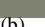

# **Stable Fluids**

Jos Stam

Alias wavefront

# **Abstract**

Building animation tools for fluid-like motions is an important and challenging problem with many applications in computer graphics. The use of physics-based models for fluid flow can greatly assist in creating such tools. Physical models, unlike key frame or procedural based techniques, permit an animator to almost effortlessly create interesting, swirling fluid-like behaviors. Also, the interaction of flows with objects and virtual forces is handled elegantly. Until recently, it was believed that physical fluid models were too expensive to allow real-time interaction. This was largely due to the fact that previous models used unstable schemes to solve the physical equations governing a fluid. In this paper, for the first time, we propose an unconditionally stable model which still produces complex fluid-like flows. As well, our method is very easy to implement. The stability of our model allows us to take larger time steps and therefore achieve faster simulations. We have used our model in conjuction with advecting solid textures to create many fluid-like animations interactively in two- and three-dimensions.

**CR Categories:** I.3.7 [Computer Graphics]: Three-Dimensional Graphics and Realism—Animation

**Keywords:** animation of fluids, Navier-Stokes, stable solvers, implicit elliptic PDE solvers, interactive modeling, gaseous phenomena, advected textures

## **1 Introduction**

One of the most intriguing problems in computer graphics is the simulation of fluid-like behavior. A good fluid solver is of great importance in many different areas. In the special effects industry there is a high demand to convincingly mimic the appearance and behavior of fluids such as smoke, water and fire. Paint programs can also benefit from fluid solvers to emulate traditional techniques such as watercolor and oil paint. Texture synthesis is another possible application. Indeed, many textures result from fluid-like processes, such as erosion. The modeling and simulation of fluids is, of course, also of prime importance in most scientific disciplines and in engineering. Fluid mechanics is used as the standard mathematical framework on which these simulations are based. There is a consensus among scientists that the *Navier-Stokes* equations are a very good model for fluid flow. Thousands of books and

SIGGRAPH 99, Los Angeles, CA USA

Copyright ACM 1999 0-201-48560-5/99/08 . . . \$5.00

articles have been published in various areas on how to compute these equations numerically. Which solver to use in practice depends largely on the problem at hand and on the computing power available. Most engineering tasks require that the simulation provide accurate bounds on the physical quantities involved to answer questions related to safety, performance, etc. The visual appearance (shape) of the flow is of secondary importance in these applications. In computer graphics, on the other hand, the shape and the behavior of the fluid are of primary interest, while physical accuracy is secondary or in some cases irrelevant. Fluid solvers, for computer graphics, should ideally provide a user with a tool that enables her to achieve fluid-like effects in real-time. These factors are more important than strict physical accuracy, which would require too much computational power.

In fact, most previous models in computer graphics were driven by visual appearance and not by physical accuracy. Early flow models were built from simple primitives. Various combinations of these primitives allowed the animation of particles systems [15, 17] or simple geometries such as leaves [23]. The complexity of the flows was greatly improved with the introduction of random turbulences [16, 20]. These turbulences are mass conserving and, therefore, automatically exhibit rotational motion. Also the turbulence is periodic in space and time, which is ideal for motion "texture mapping" [19]. Flows built up from a superposition of flow primitives all have the disadvantage that they do not respond dynamically to user-applied external forces. Dynamical models of fluids based on the Navier-Stokes equations were first implemented in two-dimensions. Both Yaeger and Upson and Gamito et al. used a vortex method coupled with a Poisson solver to create two-dimensional animations of fluids [24, 8]. Later, Chen et al. animated water surfaces from the pressure term given by a twodimensional simulation of the Navier-Stokes equations [2]. Their method unlike ours is both limited to two-dimensions and is unstable. Kass and Miller linearize the shallow water equations to simulate liquids [12]. The simplifications do not, however, capture the interesting rotational motions characteristic of fluids. More recently, Foster and Metaxas clearly show the advantages of using the full three-dimensional Navier-Stokes equations in creating fluid-like animations [7]. Many effects which are hard to key frame manually such as swirling motion and flows past objects are obtained automatically. Their algorithm is based mainly on the work of Harlow and Welch in computational fluid dynamics, which dates back to 1965 [11]. Since then many other techniques which Foster and Metaxas could have used have been developed. However, their model has the advantage of being simple to code, since it is based on a finite differencing of the Navier-Stokes equations and an explicit time solver. Similar solvers and their source code are also available from the book of Griebel et al. [9]. The main problem with explicit solvers is that the numerical scheme can become unstable for large time-steps. Instability leads to numerical simulations that "blow-up" and therefore have to be restarted with a smaller time-step. The instability of these explicit algorithms sets serious limits on speed and interactivity. Ideally, a user should be able to interact in real-time with a fluid solver without having to worry about possible "blow ups".

In this paper, for the first time, we propose a stable algorithm that solves the full Navier-Stokes equations. Our algorithm is very

Alias wavefront, 1218 Third Ave, 8th Floor, Seattle, WA 98101, U.S.A. jstam@aw.sgi.com

Permission to make digital or hard copies of all or part of this work for personal or classroom use is granted without fee provided that copies are not made or distributed for profit or commercial advantage and that copies bear this notice and the full citation on the first page. To copy otherwise, to republish, to post on servers or to redistribute to lists, requires prior specific permission and/or a fee.

easy to implement and allows a user to interact in real-time with three-dimensional fluids on a graphics workstation. We achieve this by using time-steps much larger than the ones used by Foster and Metaxas. To obtain a stable solver we depart from Foster and Metaxas' method of solution. Instead of their explicit Eulerian schemes, we use both Lagrangian and implicit methods to solve the Navier-Stokes equations. Our method cannot be found in the computational fluids literature, since it is custom made for computer graphics applications. The model would not be accurate enough for most engineering applications. Indeed, it suffers from too much "numerical dissipation", i.e., the flow tends to dampen too rapidly as compared to actual experiments. In a computer graphical application, on the other hand, this is not so bad, especially in an interactive system where the flow is "kept alive" by an animator applying external forces. In fact, a flow which does not dampen at all might be too chaotic and difficult to control. As our results demonstrate we are able to produce nice swirling flows despite the numerical dissipation.

In this paper we apply our flows mainly to the simulation of gaseous-like phenomena. We employ our solver to update both the flow and the motion of densities within the flow. To further increase the complexity of our animations we advect texture coordinates along with the density [13]. In this manner we are able to synthesize highly detailed "wispy" gaseous flows even with low resolution grids. We believe that the combination of physics-based fluid solvers and solid textures is the most promising method of achieving highly complex flows in computer graphics.

The next section presents the Navier-Stokes equations and the derivation which leads to our method of solution. That section contains all the fundamental ideas and techniques needed to obtain a stable fluids solver. Since it relies on sophisticated mathematical techniques, it is written in a mathematical physics jargon which should be familiar to most computer graphics researchers working in physics-based modeling. The application oriented reader who wishes only to implement our solver can skip Section 2 entirely and go straight to Section 3. There we describe our implementation of the solver, providing sufficient information to code our technique. Section 4 is devoted to several applications that demonstrate the power of our new solver. Finally, in Section 5 we conclude and discuss future research. To keep this within the confines of a short paper, we have decided not to include a "tutorial-type" section on fluid dynamics, since there are many excellent textbooks which provide the necessary background and intuition. Readers who do not have a background in fluid dynamics and who wish to fully understand the method in this paper should therefore consult such a text. Mathematically inclined readers may wish to start with the excellent book by Chorin and Marsden [3]. Readers with an engineering bent on the other hand can consult the didactic book by Abbott [1]. Also, Foster and Metaxas' paper does a good job of introducing the concepts from fluid dynamics to the computer graphics community.

#### Stable Navier-Stokes 2

### 2.1 Basic Equations

In this section we present the Navier-Stokes equations along with the manipulations that lead to our stable solver. A fluid whose density and temperature are nearly constant is described by a velocity field  $\mathbf{u}$  and a pressure field  $p$ . These quantities generally vary both in space and in time and depend on the boundaries surrounding the fluid. We will denote the spatial coordinate by  $x$ , which for twodimensional fluids is  $\mathbf{x} = (x, y)$  and three-dimensional fluids is equal to  $(x, y, z)$ . We have decided not to specialize our results for a particular dimension. All results are thus valid for both twodimensional and three-dimensional flows unless stated otherwise. Given that the velocity and the pressure are known for some initial

time  $t = 0$ , then the evolution of these quantities over time is given by the Navier-Stokes equations [3]:

$$\nabla \cdot \mathbf{u} = 0 \tag{1}$$

$$\frac{\partial \mathbf{u}}{\partial t} = -(\mathbf{u} \cdot \nabla)\mathbf{u} - \frac{1}{\rho}\nabla p + \nu \nabla^2 \mathbf{u} + \mathbf{f}, \qquad (2)$$

where  $\nu$  is the kinematic viscosity of the fluid,  $\rho$  is its density and  $\mathbf{f}$  is an external force. Some readers might be unfamiliar with this compact version of the Navier-Stokes equations. Eq. 2 is a vector equation for the three (two in two-dimensions) components of the velocity field. The "." denotes a dot product between vectors, while the symbol  $\nabla$  is the vector of spatial partial derivatives. More precisely,  $\nabla = (\partial/\partial x, \partial/\partial y)$  in two-dimensions and  $\nabla = (\partial/\partial x, \partial/\partial y, \partial/\partial z)$  in three-dimensions. We have also used the shorthand notation  $\nabla^2 = \nabla \cdot \nabla$ . The Navier-Stokes equations are obtained by imposing that the fluid conserves both mass (Eq. 1) and momentum (Eq. 2). We refer the reader to any standard text on fluid mechanics for the actual derivation. These equations also have to be supplemented with boundary conditions. In this paper we will consider two types of boundary conditions which are useful in practical applications: periodic boundary conditions and fixed boundary conditions. In the case of periodic boundaries the fluid is defined on an *n*-dimensional torus  $(n = 2, 3)$ . In this case there are no walls, just a fluid which wraps around. Although such fluids are not encountered in practice, they are very useful in creating evolving texture maps. Also, these boundary conditions lead to a very elegant implementation that uses the fast Fourier transform as shown below. The second type of boundary condition that we consider is when the fluid lies in some bounded domain  $D$ . In that case, the boundary conditions are given by a function  $\mathbf{u}_D$  defined on the boundary  $\partial D$  of the domain. See Foster and Metaxas' work for a good discussion of these boundary conditions in the case of a hot fluid [7]. In any case, the boundary conditions should be such that the normal component of the velocity field is zero at the boundary; no matter should traverse walls.

The pressure and the velocity fields which appear in the Navier-Stokes equations are in fact related. A single equation for the velocity can be obtained by combining Eq. 1 and Eq. 2. We briefly outline the steps that lead to that equation, since it is fundamental to our algorithm. We follow Chorin and Marsden's treatment of the subject (p. 36ff, [3]). A mathematical result, known as the  $Helmholtz-Hodge Decomposition$ , states that any vector field **w** can uniquely be decomposed into the form:

$$\mathbf{w} = \mathbf{u} + \nabla q,\tag{3}$$

where **u** has zero divergence:  $\nabla \cdot \mathbf{u} = 0$  and  $q$  is a scalar field. Any vector field is the sum of a mass conserving field and a gradient field. This result allows us to define an operator  $\mathbf{P}$  which projects any vector field w onto its divergence free part  $\mathbf{u} = \mathbf{P}\mathbf{w}$ . The operator is in fact defined implicitly by multiplying both sides of Eq. 3 by " $\nabla$ ":

$$\nabla \cdot \mathbf{w} = \nabla^2 q. \tag{4}$$

This is a Poisson equation for the scalar field  $q$  with the Neumann boundary condition  $\frac{\partial q}{\partial n} = 0$  on  $\partial D$ . A solution to this equation is used to compute the projection  $\mathbf{u}$ :

$$\mathbf{u} = \mathbf{P}\mathbf{w} = \mathbf{w} - \nabla q.$$

If we apply this projection operator on both sides of Eq. 2 we obtain a single equation for the velocity:

$$\frac{\partial \mathbf{u}}{\partial t} = \mathbf{P} \left( -(\mathbf{u} \cdot \nabla) \mathbf{u} + \nu \nabla^2 \mathbf{u} + \mathbf{f} \right), \tag{5}$$

where we have used the fact that  $\mathbf{P}\mathbf{u} = \mathbf{u}$  and  $\mathbf{P}\nabla p = 0$ . This is our fundamental equation from which we will develop a stable fluid solver.


Figure 1: One simulation step of our solver is composed of steps. The first three steps may take the field out of the space of divergent free fields. The last projection step ensures that the field is divergent free after the entire simulation step.


Figure 2: To solve for the advection part, we trace each point of the field backward in time. The new velocity at  $x$  is therefore the velocity that the particle had a time  $\Delta t$  ago at the old location  $\mathbf{p}(\mathbf{x}, -\Delta t).$ 

### 2.2 Method of Solution

Eq. 5 is solved from an initial state  $\mathbf{u}_0 = \mathbf{u}(\mathbf{x}, 0)$  by marching through time with a time step  $\Delta t$ . Let us assume that the field has been resolved at a time  $t$  and that we wish to compute the field at a later time  $t + \Delta t$ . We resolve Eq. 5 over the time span  $\Delta t$  in four steps. We start from the solution  $\mathbf{w}_0(\mathbf{x}) = \mathbf{u}(\mathbf{x}, t)$  of the previous time step and then sequentially resolve each term on the right hand side of Eq. 5, followed by a projection onto the divergent free fields. The general procedure is illustrated in Figure 1. The steps are:

$$\mathbf{w}_0(\mathbf{x}) \stackrel{\text{add force}}{\xrightarrow{\hspace*{1.5cm}}} \mathbf{w}_1(\mathbf{x}) \stackrel{\text{advect}}{\xrightarrow{\hspace*{1.5cm}}} \mathbf{w}_2(\mathbf{x}) \stackrel{\text{diffuse}}{\xrightarrow{\hspace*{1.5cm}}} \mathbf{w}_3(\mathbf{x}) \stackrel{\text{project}}{\xrightarrow{\hspace*{1.5cm}}} \mathbf{w}_4(\mathbf{x})$$

The solution at time  $t + \Delta t$  is then given by the last velocity field:  $\mathbf{u}(\mathbf{x},t+\Delta t)=\mathbf{w}_4(\mathbf{x}).$  A simulation is obtained by iterating these steps. We now explain how each step is computed in more detail.

The easiest term to solve is the addition of the external force  $\mathbf{f}$ . If we assume that the force does not vary considerably during the time step, then

$$\mathbf{w}_1(\mathbf{x}) = \mathbf{w}_0(\mathbf{x}) + \Delta t \ \mathbf{f}(\mathbf{x}, t)$$

is a good approximation of the effect of the force on the field over the time step  $\Delta t$ . In an interactive system this is a good approximation, since forces are only applied at the beginning of each time step.

The next step accounts for the effect of advection (or convection) of the fluid on itself. A disturbance somewhere in the fluid propagates according to the expression  $-(\mathbf{u} \cdot \nabla)\mathbf{u}$ . This term makes the Navier-Stokes equations non-linear. Foster and Metaxas resolved this component using finite differencing. Their method is stable only when the time step is sufficiently small such that

 $\Delta t < \Delta \tau/|\mathbf{u}|$ , where  $\Delta \tau$  is the spacing of their computational grid. Therefore, for small separations and/or large velocities, very small time steps have to be taken. On the other hand, we use a totally different approach which results in an unconditionally stable solver. No matter how big the time step is, our simulations will never "blow up". Our method is based on a technique to solve partial differential equations known as the *method of characteristics*. Since this method is of crucial importance in obtaining our stable solver, we provide all the mathematical details in Appendix A. The method, however, can be understood intuitively. At each time step all the fluid particles are moved by the velocity of the fluid itself. Therefore, to obtain the velocity at a point x at the new time  $t + \Delta t$ , we backtrace the point  $x$  through the velocity field  $w_1$  over a time  $\Delta t$ . This defines a path  $\mathbf{p}(\mathbf{x},s)$  corresponding to a partial streamline of the velocity field. The new velocity at the point  $x$  is then set to the velocity that the particle, now at  $x$ , had at its previous location a time  $\Delta t$  ago:

$$\mathbf{w}_2(\mathbf{x}) = \mathbf{w}_1(\mathbf{p}(\mathbf{x}, -\Delta t)).$$

Figure 2 illustrates the above. This method has several advantages. Most importantly it is unconditionally stable. Indeed, from the above equation we observe that the maximum value of the new field is never larger than the largest value of the previous field. Secondly, the method is very easy to implement. All that is required in practice is a particle tracer and a linear interpolator (see next Section). This method is therefore both stable and simple to implement, two highly desirable properties of any computer graphics fluid solver. We employed a similar scheme to move densities through user-defined velocity fields [19]. Versions of the method of characteristics were also used by other researchers. The application was either employed in visualizing flow fields [13, 18] or improving the rendering of gas simulations [21, 5]. Our application of the technique is fundamentally different, since we use it to update the velocity field, which previous researchers did not dynamically animate.

The third step solves for the effect of viscosity and is equivalent to a diffusion equation:

$$\frac{\partial \mathbf{w}_2}{\partial t} = \nu \nabla^2 \mathbf{w}_2.$$

This is a standard equation for which many numerical procedures have been developed. The most straightforward way of solving this equation is to discretize the diffusion operator  $\nabla^2$  and then to do an explicit time step as Foster and Metaxas did [7]. However, this method is unstable when the viscosity is large. We prefer, therefore, to use an implicit method:

$$\left(\mathbf{I} - \nu \Delta t \nabla^2\right) \mathbf{w}_3(\mathbf{x}) = \mathbf{w}_2(\mathbf{x}),$$

where  $\mathbf{I}$  is the identity operator. When the diffusion operator is discretized, this leads to a sparse linear system for the unknown field  $\mathbf{w}_3$ . Solving such a system can be done efficiently, however (see below).

The fourth step involves the projection step, which makes the resulting field divergence free. As pointed out in the previous subsection this involves the resolution of the Poisson problem defined by Eq. 4:

$$\nabla^2 q = \nabla \cdot \mathbf{w}_3 \qquad \mathbf{w}_4 = \mathbf{w}_3 - \nabla q.$$

The projection step, therefore, requires a good Poisson solver. Foster and Metaxas solved a similar equation using a relaxation scheme. Relaxation schemes, though, have poor convergence and usually require many iterations. Foster and Metaxas reported that they obtained good results even after a very small number of relaxation steps. However, since we are using a different method to resolve for the advection step, we must use a more accurate method. Indeed, the method of characteristics is more precise when the field is close to divergent free. More importantly from a visual point of view, the projection step forces the fields to have vortices which result in more swirling-like motions. For these reasons we have used a more accurate solver for the projection step.

The Poisson equation, when spatially discretized, becomes a sparse linear system. Therefore, both the projection and the viscosity steps involve the solution of a large sparse system of equations. Multigrid methods, for example, can solve sparse linear systems in linear time [10]. Since our advection solver is also linear in time, the complexity of our proposed algorithm is of complexity  $O(N)$ . Foster and Metaxas' solver has the same complexity. This performance is theoretically optimal since for a complicated fluid, any algorithm has to consult at least each cell of the computational grid.

#### Periodic Boundaries and the FFT 23

When we consider a domain with periodic boundary conditions, our algorithm takes a particularly simple form. The periodicity allows us to transform the velocity into the Fourier domain:

$$\mathbf{u}(\mathbf{x},t) \longrightarrow \hat{\mathbf{u}}(\mathbf{k},t)$$

In the Fourier domain the gradient operator " $\nabla$ " is equivalent to the multiplication by  $i\mathbf{k}$ , where  $i = \sqrt{-1}$ . Consequently, both the diffusion step and the projection step are much simpler to solve. Indeed the diffusion operator and the projection operators in the Fourier domain are

$$\mathbf{I} - \nu \Delta t \nabla^2 \longrightarrow 1 + \nu \Delta t k^2 \quad \text{and}$$
$$\mathbf{P} \mathbf{w} \longrightarrow \hat{\mathbf{P}} \hat{\mathbf{w}}(\mathbf{k}) = \hat{\mathbf{w}}(\mathbf{k}) - \frac{1}{k^2} (\mathbf{k} \cdot \hat{\mathbf{w}}(\mathbf{k})) \mathbf{k},$$

where  $k = |\mathbf{k}|$ . The operator  $\hat{\mathbf{P}}$  projects the vector  $\hat{\mathbf{w}}(\mathbf{k})$  onto the plane which is normal to the wave number  $\mathbf{k}$ . The Fourier transform of the velocity of a divergent free field is therefore always perpendicular to its wavenumbers. The diffusion can be interpreted as a low pass filter whose decay is proportional to both the time step and the viscosity. These simple results demonstrate the power of the Fourier transform. Indeed, we are able to completely transcribe our solver in only a couple of lines. All that is required is a particle tracer and a fast Fourier transform (FFT).

FourierStep( $\mathbf{w}_0, \mathbf{w}_4, \Delta t$ ): add force:  $\mathbf{w}_1 = \mathbf{w}_0 + \Delta t \mathbf{f}$ advect:  $\mathbf{w}_2(\mathbf{x}) = \mathbf{w}_1(\mathbf{p}(\mathbf{x}, -\Delta t))$ transform:  $\hat{\mathbf{w}}_2 = \text{FFT}\{\mathbf{w}_2\}$ diffuse:  $\hat{\mathbf{w}}_3(\mathbf{k}) = \hat{\mathbf{w}}_2(\mathbf{k})/(1+\nu\Delta t k^2)$ project:  $\hat{\mathbf{w}}_4 = \hat{\mathbf{P}} \hat{\mathbf{w}}_3$ transform:  $\mathbf{w}_4 = \text{FFT}^{-1}\{\hat{\mathbf{w}}_4\}$ 

Since the Fourier transform is of complexity  $O(N \log N)$ , this method is theoretically slightly more expensive than a method of solution relying on multi-grid solvers. However, this method is very easy to implement. We have used this algorithm to generate the "liquid textures" of Section 4.

### 2.4 Moving Substances through the Fluid

A non-reactive substance which is injected into the fluid will be advected by it while diffusing at the same time. Common examples of this phenomenon include the patterns created by milk stirred in coffee or the smoke rising from a cigarette. Let  $a$  be any scalar quantity which is moved through the fluid. Examples of this quantity include the density of dust, smoke or cloud droplets, the temperature of a


Figure 3: The values of the discretized fields are defined at the center of the grid cells.

fluid and a texture coordinate. The evolution of this scalar field is conveniently described by an advection diffusion type equation:

$$\frac{\partial a}{\partial t} = -\mathbf{u} \cdot \nabla a + \kappa_a \nabla^2 - \alpha_a a + S_a$$

where  $\kappa_a$  is a diffusion constant,  $\alpha_a$  is a dissipation rate and  $S_a$  is a source term. This equation is very similar in form to the Navier-Stokes equation. Indeed, it includes an advection term, a diffusion term and a "force term"  $S_a$ . All these terms can be resolved exactly in the same way as the velocity of the fluid. The dissipation term not present in the Navier-Stokes equation is solved as follows over a time-step:

$$(1 + \Delta t \alpha_a) a(\mathbf{x}, t + \Delta t) = a(\mathbf{x}, t).$$

Similar equations were used by Stam and Fiume to simulate fire and other gaseous phenomena [21]. However, their velocity fields were not computed dynamically.

We hope that the material in this section has convinced the reader that our stable solver is indeed based on the full Navier-Stokes equations. Also, we have pointed to the numerical techniques which should be used at each step of our solver. We now proceed to describe the implementation of our model in more detail.

#### Our Solver 3

#### $3.1$ Setup

Our implementation handles both the motion of fluids and the propagation by the fluid of any number of substances like mass-density, temperature or texture coordinates. Each quantity is defined on either a two-dimensional (NDIM=2) or three-dimensional (NDIM=3) grid, depending on the application. The grid is defined by its physical dimensions: origin  $O[NDIM]$  and length  $L[NDIM]$  of each side, and by its number of cells N[NDIM] in each coordinate. This in turn determines the size of each voxel  $D[i] = L[i]/N[i]$ . The definition of the grid is an input to our program which is specified by the animator. The velocity field is defined at the center of each cell as shown in Figure 3. Notice that previous researchers, e.g., [7], defined the velocity at the boundaries of the cells. We prefer the cell-centered grid since it is more straightforward to implement. We allocate two grids for each component of the velocity: U0[NDIM] and U1[NDIM]. At each time step of our simulation one grid corresponds to the solution obtained in the previous step. We store the new solution in the second grid. After each step, the grids are swapped. We also allocate two grids to hold a scalar field corresponding to a substance transported by the flow. Although our implementation can handle any number of substances, for the sake of clarity we present only the algorithm for one field in this section. This scalar quantity is stored in the grids S0 and S1. The speed of interactivity is controlled by a single time step  $dt$ , which can be as large as the animator wishes, since our algorithm is stable.

The physical properties of the fluid are a function of its viscosity visc alone. By varying the viscosity, an animator can simulate a wide range of substances ranging from glue-like matter to highly turbulent flows. The properties of the substance are modeled by a diffusion constant kS and a dissipation rate aS. Along with these parameters, the animator also must specify the values of these fields on the boundary of the grid. There are basically two types: periodic or fixed. The boundary conditions can be of a different type for each coordinate. When periodic boundary conditions are chosen, the fluid wraps around. This means that a piece of fluid which leaves the grid on one side reenters the grid on the opposite side. In the case of fixed boundaries, the value of each physical quantity must be specified at the boundary of the grid. The simplest method is to set the field to zero at the boundary. We refer the reader to Foster and Metaxas' paper for an excellent description of different boundary conditions and their resulting effects [7]. In the results section we describe the boundary conditions chosen for each animation. For the special case when the boundary conditions are periodic in each coordinate, a very elegant solver based on the fast Fourier transform can be employed. This algorithm is described in Section 2.3. We do not repeat it here since the solver in this section is more general and can handle both types of boundary conditions.

The fluid is set into motion by applying external forces to it. We have written an animation system in which an animator with a mouse can apply directional forces to the fluid. The forces can also be a function of other substances in the fluid. For example, a temperature field moving through the fluid can produce buoyant and turbulent forces. In our system we allow the user to create all sorts of dependencies between the various fields, some of which are described in the results section of this paper. We do not describe our animation system in great detail since its functionality should be evident from the examples of the next section. Instead we focus on our simulator, which takes the forces and parameters set by the animator as an input.

### **3.2 The Simulator**

Once we worked out the mathematics underlying the Navier-Stokes equations in Section 2, our implementation became straightforward. We wish to emphasize that the theoretical developments of Section 2 are in no way gratuitous but are immensely useful in coding compact solvers. In particular, casting the problem into a mathematical setting has allowed us to take advantage of the large body of work done in the numerical analysis of partial differential equations. We have written the solver as a separate library of routines that are called by the interactive animation system. The entire library consists of only roughly 500 lines of C code. The two main routines of this library update either the velocity field Vstep or a scalar field Sstep over a given time step. We assume that the external force is given by an array of vectors F[NDIM] and that the source is given by an array Ssource for the scalar field. The general structure of our simulator looks like

```
while ( simulating ) f
 /* handle display and user interaction */
 /* get forces F and sources Ssource from the UI */
 Swap(U1,U0); Swap(S1,S0);
 Vstep ( U1, U0, visc, F, dt );
 Sstep ( S1, S0, kS, aS, U1, Ssource, dt );
g
```

The velocity solver is composed of four steps: the forces are added to the field, the field is advected by itself, the field diffuses due to viscous friction within the fluid, and in the final step the velocity is forced to conserve mass. The general structure of this routine is:

Vstep ( U1, U0, visc, F, dt )

```
for(i=0;i<NDIM;i++)
 addForce ( U0[i], F[i], dt );
for(i=0;i<NDIM;i++)
 Transport ( U1[i], U0[i], U0, dt );
for(i=0;i<NDIM;i++)
 Diffuse ( U0[i], U1[i], visc, dt );
Project ( U1, U0, dt );
```

The general structure of the scalar field solver is very similar to the above. It involves four steps: add the source, transport the field by the velocity, diffuse and finally dissipate the field. The scalar field solver shares some of the routines called by the velocity solver:

```
Sstep ( S1, S0, k, a, U, source, dt )
 addForce ( S0, source, dt );
 Transport ( S1, S0, U, dt );
 Diffuse ( S0, S1, k, dt );
 Dissipate ( S1, S0, a, dt );
```

The addForce routine adds the force field multiplied by the time step to each value of the field. The dissipation routine Dissipate divides each element of the first array by 1+dt\*a and stores it in the new array. The Transport routine is a key step in our simulation. It accounts for the movement of the substance due to the velocity field. More importantly it is used to resolve the nonlinearity of the Navier-Stokes equations. The general structure of this routine (in three-dimensions) is

```
Transport ( S1, S0, U, dt )
 for each cell (i,j,k) do
  X = O+(i+0.5,j+0.5,k+0.5)*D;
  TraceParticle ( X, U, -dt, X0 );
  S1[i,j,k] = LinInterp ( X0, S0 );
 end
```

The routine TraceParticle traces a path starting at X through the field U over a time -dt. The endpoint of this path is the new point X0. We use both a simple second order Runge-Kutta (RK2) method for the particle trace [14] and an adaptive particle tracer, which subsamples the time step only in regions of high velocity gradients, such as near object boundaries. The routine LinInterp linearly interpolates the value of the scalar field S at the location X0. We note that we did not use a higher order interpolation, since this might lead to instabilities due to the oscillations and overshoots inherent in such interpolants. On the other hand, higher order spline approximants may be used, though these tend to smooth out the resulting flows.

To solve for the diffusion (Diffuse) and to perform the projection (Project) we need a sparse linear solver SolveLin. The best theoretical choice is the multi-grid algorithm [10]. However, we used a solver from the FISHPAK library since it was very easy to incorporate into our code and gave good results [22]<sup>1</sup> . In practice, it turned out to be faster than our implementation of the multi-grid algorithm. In Appendix B, we show exactly how these routines are used to perform both the Diffuse step and the Project step. These routines are ideal for domains with no internal boundaries. When complex boundaries or objects are within the flow, one can either use a sophisticated multi-grid solver or a good relaxation routine [9]. In any case, our simulator can easily accomodate new solvers.

<sup>1</sup>FISHPAK is available from http://www.netlib.org.

### 4 Results

Our Navier-Stokes solver can be used in many applications requiring fluid-like motions. We have implemented both the two- and the three-dimensional solvers in an interactive modeler that allows a user to interact with the fluids in real-time. The motion is modeled by either adding density into the fluid or by applying forces. The evolution of the velocity and the density is then computed using our solver. To further increase the visual complexity of the flows, we add textural detail to the density. By moving the texture coordinates using the scalar solver as well, we achieve highly detailed flows. To compensate for the high distortions that the texture maps undergo, we use three sets of texture coordinates which are periodically reset to their initial (unperturbed) values. At every moment the resulting texture map is the superposition of these three texture maps. This idea was first suggested by Max et al. [13].

Figure  $4.(a)$  shows a sequence of frames from an animation where the user interacts with one of our liquid textures. The figure on the backcover of the SIGGRAPH proceedings is another frame of a similar sequence with a larger grid size  $(100^2)$ .

Figures 4.(b) through 4.(g) show frames from various animations that we generated using our three-dimensional solver. In each case the animations were created by allowing the animator to place density and apply forces in real-time. The gases are volume rendered using the three-dimensional hardware texture mapping capabilities of our SGI Octane workstation. We also added a single pass that computes self-shadowing effects from a directional light source in a fixed position. It should be evident that the quality of the renderings could be further improved using more sophisticated rendering hardware or software. Our grid sizes ranged from  $16^3$  to  $30^3$  with frame rates fast enough to monitor the animations while being able to control their behavior. In most of these animations we added a "noise" term which is proportional to the amount of density (the factor of proportionality being a user defined parameter). This produced nice billowing motions in some of our animations. In Figures  $4.(d)-(e)$  we used a fractal texture map, while in Figure  $4.(g)$ we used a texture map consisting of evenly spaced lines.

All of our animations were created on an SGI Octane workstation with a R10K processor and 192 Mbytes of memory.

#### 5 Conclusions

The motivation of this paper was to create a general software system that allows an animator to design fluid-like motions in real time. Our initial intention was to base our system on Foster and Metaxas' work. However, the instabilities inherent in their method forced us to develop a new algorithm. Our solver has the property of being unconditionally stable and it can handle a wide variety of fluids in both two- and three-dimensions. The results that accompany this paper clearly demonstrate that our solver is powerful enough to allow an animator to achieve many fluid-like effects. We therefore believe that our solver is a substantial improvement over previous work in this area. The work presented here does not, however, discredit previous, more visually oriented models. In particular, we believe that the combination of our fluid solvers with solid textures, for example, may be a promising area of future research [4]. Our fluid solvers can be used to generate the overall motion, while the solid texture can add additional detail for higher quality animations.

Also we have not addressed the problem of simulating fluids with free boundaries, such as water [6]. This problem is considerably more difficult, since the geometry of the boundary evolves dynamically over time. We hope, however, that our stable solvers may be applied to this problem as well. Also, we wish to extend our solver to finite element boundary-fitted meshes. We are currently investigating such extensions.

## Acknowledgments

I would like to thank Marcus Grote for his informed input on fluid dynamics and for pointing me to reference [3]. Thanks to Duncan Brinsmead for his constructive criticisms all along. Thanks also to Pamela Jackson for carefully proofreading the paper and to Brad Clarkson for his help with creating the videos.

#### **Method of Characteristics** Α

The method of characteristics can be used to solve advection equations of the type

$$\frac{\partial a(\mathbf{x},t)}{\partial t} = -\mathbf{v}(\mathbf{x}) \cdot \nabla a(\mathbf{x},t) \quad \text{and} \quad a(\mathbf{x},0) = a_0(\mathbf{x}),$$

where  $a$  is a scalar field,  $\mathbf{v}$  is a steady vector field and  $a_0$  is the field at time  $t = 0$ . Let  $\mathbf{p}(\mathbf{x}_0, t)$  denote the *characteristics* of the vector field **v** which flow through the point  $\mathbf{x}_0$  at  $t = 0$ :

$$\frac{d}{dt}\mathbf{p}(\mathbf{x}_0,t) = \mathbf{v}(\mathbf{p}(\mathbf{x}_0,t)) \quad \text{and} \quad \mathbf{p}(\mathbf{x}_0,0) = \mathbf{x}_0.$$

Now let  $\bar{a}(\mathbf{x}_0, t) = a(\mathbf{p}(\mathbf{x}_0, t), t)$  be the value of the field along the characteristic passing through the point  $\mathbf{x}_0$  at  $t = 0$ . The variation of this quantity over time can be computed using the chain rule of differentiation:

$$\frac{d\bar{a}}{dt} = \frac{\partial a}{\partial t} + \mathbf{v} \cdot \nabla a = 0.$$

This shows that the value of the scalar does not vary along the streamlines. In particular, we have  $\bar{a}(\mathbf{x}_0,t) = \bar{a}(\mathbf{x}_0,0) = a_0(\mathbf{x}_0)$ . Therefore, the initial field and the characteristics entirely define the solution to the advection problem. The field for a given time  $t$  and location  $x$  is computed by first tracing the location  $x$  back in time along the characteristic to get the point  $x_0$ , and then evaluating the initial field at that point:

$$a(\mathbf{p}(\mathbf{x}_0,t),t) = a_0(\mathbf{x}_0).$$

We use this method to solve the advection equation over a time interval  $[t, t + \Delta t]$  for the fluid. In this case,  $\mathbf{v} = \mathbf{u}(\mathbf{x}, t)$  and  $a_0$  is any of the components of the fluid's velocity at time  $t$ .

#### FISHPAK Routines В

The linear solver POIS3D from FISHPAK is designed to solve a general system of finite difference equations of the type:

```
K1*(S[i-1,j,k]-2*S[i,j,k]+S[i+1,j,k]) +K2*(S[i,j-1,k]-2*S[i,j,k]+S[i,j+1,k]) +A[k]*S[i,j,k-1]+B[k]*S[i,j,k]+
```

For the diffusion solver, the values of the constants on the left hand side are

```
K1 = -dt*k/(D[0]*D[0]),K2 = -dt*k/(D[1]*D[1]),A[k] = C[k] = -dt*k/(D[2]*D[2]) and
B[k] = 1+2*dt*k/(D[2]*D[2]),
```

while the right hand side is equal to the grid containing the previous solution:  $F = S0$ . In the projection step these constants are equal to

```
K1 = 1/(D[0]*D[0]), K2 = 1/(D[1]*D[1]),A[k] = C[k] = 1/(D[2]*D[2]) and
B[k] = -2/(D[2]*D[2]),
```

while the right hand side is equal to the divergence of the velocity field:

$$F[i,j,k] = 0.5*((U[i+1,j,k]-U[i-1,j,k])/D[0]+(U[i,j+1,k]-U[i,j-1,k])/D[1]+(U[i,j,k+1]-U[i,j,k-1])/D[2]).$$

The gradient of the solution is then subtracted from the previous solution:

U1[0][i,j,k] = U0[0][i,j,k] - 0.5\*(S[i+1,j,k]-S[i-1,j,k])/D[0], U1[1][i,j,k] = U0[1][i,j,k] - 0.5\*(S[i,j+1,k]-S[i,j-1,k])/D[1], U1[2][i,j,k] = U0[2][i,j,k] - 0.5\*(S[i,j,k+1]-S[i,j,k-1])/D[2].

The FISHPAK routine is also able to handle different types of boundary conditions, both periodic and fixed.

# **References**

- [1] M. B. Abbott. *Computational Fluid Dynamics: An Introduction for Engineers*. Wiley, New York, 1989.
- [2] J. X. Chen, N. da Vittoria Lobo, C. E. Hughes, and J. M. Moshell. Real-Time Fluid Simulation in a Dynamic Virtual Environment. *IEEE Computer Graphics and Applications*, pages 52–61, May-June 1997.
- [3] A. J. Chorin and J. E. Marsden. *A Mathematical Introduction to Fluid Mechanics*. Springer-Verlag. Texts in Applied Mathematics 4. Second Edition., New York, 1990.
- [4] D. Ebert, K. Musgrave, D. Peachy, K. Perlin, and S. Worley. *Texturing and Modeling: A Procedural Approach*. AP Professional, 1994.
- [5] D. S. Ebert, W. E. Carlson, and R. E. Parent. Solid Spaces and Inverse Particle Systems for Controlling the Animation of Gases and Fluids. *The Visual Computer*, 10:471–483, 1994.
- [6] N. Foster and D. Metaxas. Realistic Animation of Liquids. *Graphical Models and Image Processing*, 58(5):471– 483, 1996.
- [7] N. Foster and D. Metaxas. Modeling the Motion of a Hot, Turbulent Gas. In *Computer Graphics Proceedings, Annual Conference Series, 1997*, pages 181–188, August 1997.
- [8] M. N. Gamito, P. F. Lopes, and M. R. Gomes. Twodimensional Simulation of Gaseous Phenomena Using Vortex Particles. In *Proceedings of the 6th Eurographics Workshop on Computer Animation and Simulation*, pages 3–15. Springer-Verlag, 1995.
- [9] M. Griebel, T. Dornseifer, and T. Neunhoeffer. *Numerical Simulation in Fluid Dynamics: A Practical Introduction*. SIAM, Philadelphia, 1998.
- [10] W. Hackbusch. *Multi-grid Methods and Applications*. Springer Verlag, Berlin, 1985.
- [11] F. H. Harlow and J. E. Welch. Numerical Calculation of Time-Dependent Viscous Incompressible Flow of Fluid with Free Surface. *The Physics of Fluids*, 8:2182–2189, December 1965.

- [12] M. Kass and G. Miller. Rapid, Stable Fluid Dynamics for Computer Graphics. *ACM Computer Graphics (SIGGRAPH '90)*, 24(4):49–57, August 1990.
- [13] N. Max, R. Crawfis, and D. Williams. Visualizing Wind Velocities by Advecting Cloud Textures. In *Proceedings of Visualization '92*, pages 179–183, Los Alamitos CA, October 1992. IEEE CS Press.
- [14] W. H. Press, B. P. Flannery, S. A. Teukolsky, and W. T. Vetterling. *Numerical Recipes in C. The Art of Scientific Computing*. Cambridge University Press, Cambridge, 1988.
- [15] W. T. Reeves. Particle Systems. A Technique for Modeling a Class of Fuzzy Objects. *ACM Computer Graphics (SIG-GRAPH '83)*, 17(3):359–376, July 1983.
- [16] M. Shinya and A. Fournier. Stochastic Motion Motion Under the Influence of Wind. In *Proceedings of Eurographics '92*, pages 119–128, September 1992.
- [17] K. Sims. Particle Animation and Rendering Using Data Parallel Computation. *ACM Computer Graphics (SIGGRAPH '90)*, 24(4):405–413, August 1990.
- [18] K. Sims. Choreographed Image Flow. *The Journal Of Visualization And Computer Animation*, 3:31–43, 1992.
- [19] J. Stam. A General Animation Framework for Gaseous Phenomena. *ERCIM Research Report*, R047, January 1997. http://www.ercim.org/publications/technical reports/047-abstract.html.
- [20] J. Stam and E. Fiume. Turbulent Wind Fields for Gaseous Phenomena. In *Proceedings of SIGGRAPH '93*, pages 369– 376. Addison-Wesley Publishing Company, August 1993.
- [21] J. Stam and E. Fiume. Depicting Fire and Other Gaseous Phenomena Using Diffusion Processes. In *Proceedings of SIGGRAPH '95*, pages 129–136. Addison-Wesley Publishing Company, August 1995.
- [22] P. N. Swarztrauber and R. A. Sweet. Efficient Fortran Subprograms for the Solution of Separable Elliptic Partial Differential Equations. *ACM Transactions on Mathematical Software*, 5(3):352–364, September 1979.
- [23] J. Wejchert and D. Haumann. Animation Aerodynamics. *ACM Computer Graphics (SIGGRAPH '91)*, 25(4):19–22, July 1991.
- [24] L. Yaeger and C. Upson. Combining Physical and Visual Simulation. Creation of the Planet Jupiter for the Film 2010. *ACM Computer Graphics (SIGGRAPH '86)*, 20(4):85–93, August 1986.





(g)

Figure 4: Snapshots from our interactive fluid solver.