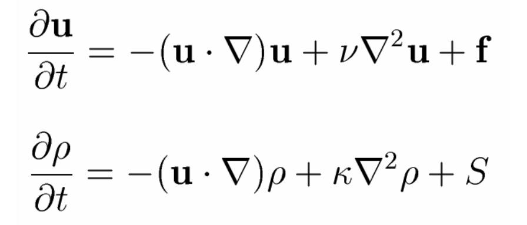
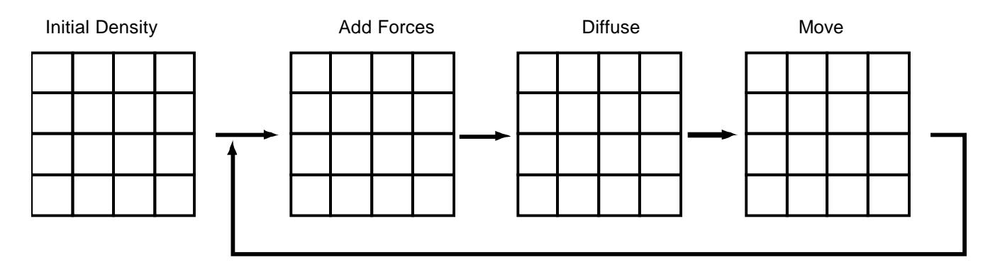
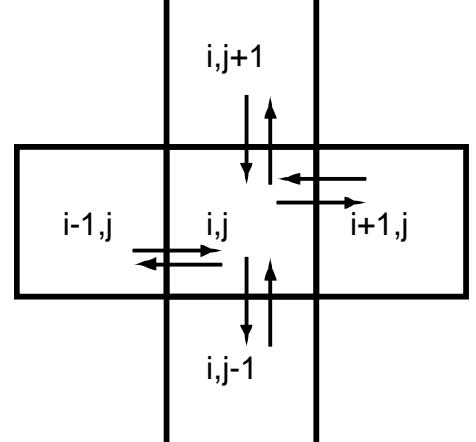
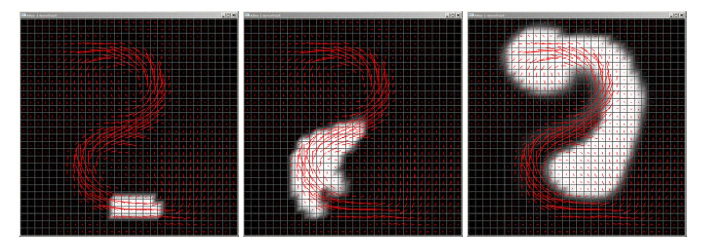
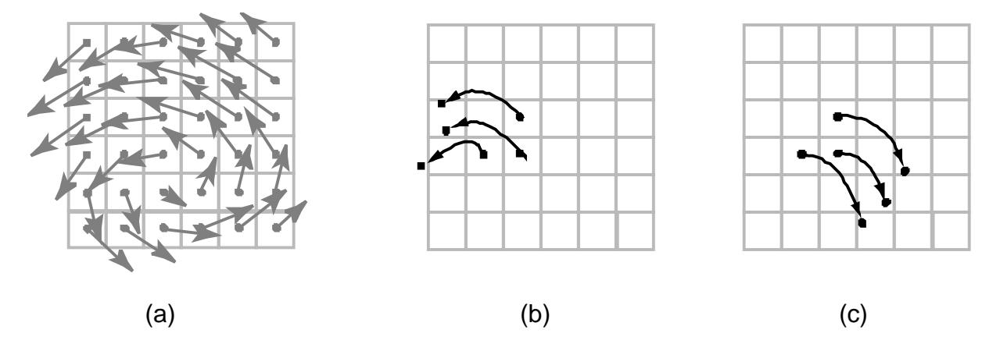
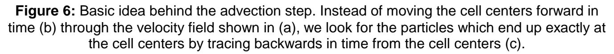
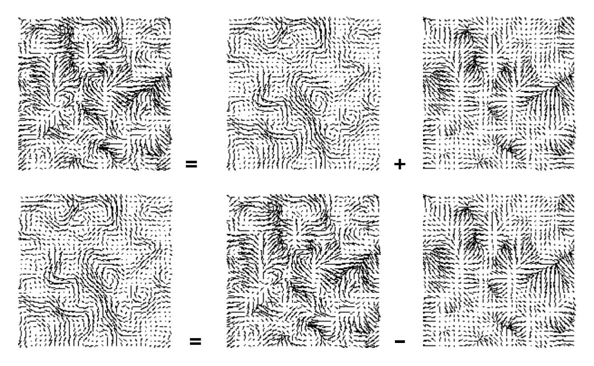
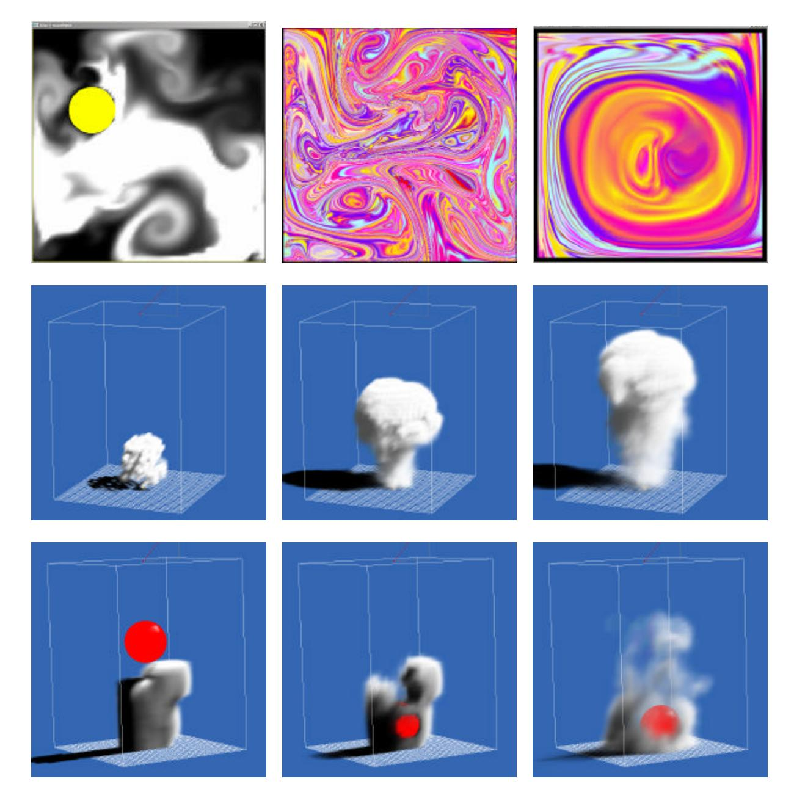
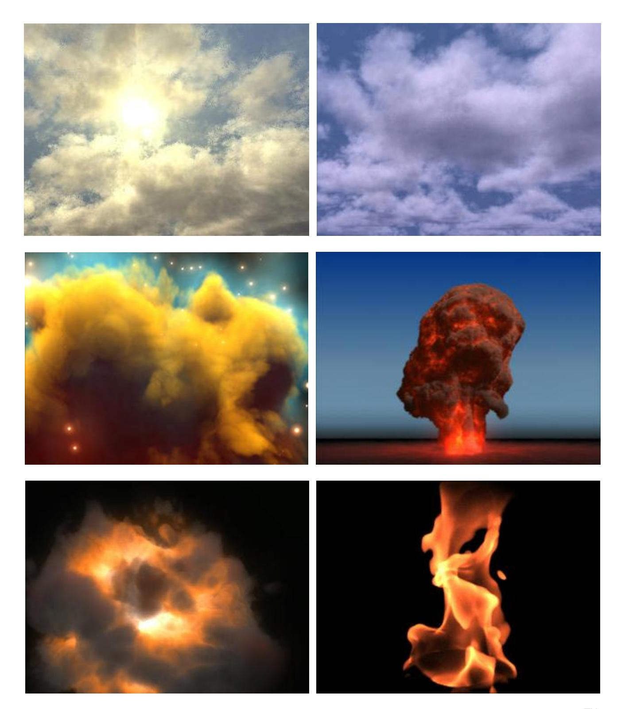
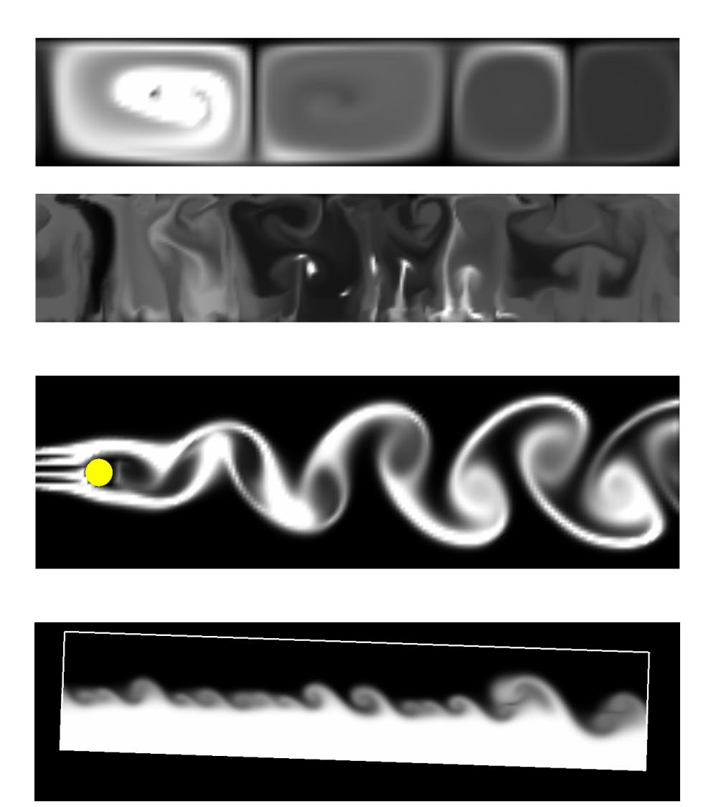

# Real-Time Fluid Dynamics for Games

Jos Stam

Alias | wavefront 210 King Street East Toronto, Ontario, Canada M5A 1J7 Email: jstam@aw.sgi.com, Url: http://www.dgp.toronto.edu/people/stam/reality/index.html.

## **Abstract**

In this paper we present a simple and rapid implementation of a fluid dynamics solver for game engines. Our tools can greatly enhance games by providing realistic fluid-like effects such as swirling smoke past a moving character. The potential applications are endless. Our algorithms are based on the physical equations of fluid flow, namely the Navier-Stokes equations. These equations are notoriously hard to solve when strict physical accuracy is of prime importance. Our solvers on the other hand are geared towards visual quality. Our emphasis is on stability and speed, which means that our simulations can be advanced with arbitrary time steps. We also demonstrate that our solvers are easy to code by providing a complete C code implementation in this paper. Our algorithms run in real-time for reasonable grid sizes in both two and three dimensions on standard PC hardware, as demonstrated during the presentation of this paper at the conference.

# **Introduction**

Fluid flows are everywhere: from rising smoke, clouds and mist to the flow of rivers and oceans. Because one of the major goals of games is to immerse players into plausible virtual worlds, it is desirable to include fluid flows into game engines. There already exist many adhoc models that attempt to fake fluid-like effects, such as particles rendered as textured sprites. However, animating them in a convincing manner is not easy.

We believe that a better alternative is to use the physics of fluid flows which have been developed since the time of Euler, Navier and Stokes (from the 1750's to the 1850's). These developments have led to the so-called **Navier-Stokes Equations**, a precise mathematical model for most fluid flows occurring in Nature. These equations, however, only admit analytical solutions in very simple cases. No progress was therefore made until the 1950's when researchers started to use computers and develop numerical algorithms to solve the equations. In general, these algorithms strive for accuracy and are fairly complex and time consuming. This is because the applications that require these solvers have to be physically accurate. It is obviously crucial that the stresses and drag on an airplane or a bridge are calculated precisely.

In computer graphics and in games on the other hand what matters most is that the simulations both look convincing and are fast. In addition it is important that the solvers aren't too complex so that they can be implemented on standard PCs, game consoles or PDAs. In this paper we present a set of algorithms which meet these requirements. To achieve these goals we depart from conventional wisdom in computational physics and develop algorithms custom tailored for creating visual effects. Unlike physically accurate solvers which have strict bounds on their time steps, our algorithms are **stable**, and never "blow up."

### **The Physics of Fluids**



**Figure 1:** The Navier-Stokes Equations for the velocity in a compact vector notation (top) and the equation for a density moving through the velocity field (bottom).

Mathematically, the state of a fluid at a given instant of time is modeled as a velocity vector field: a function that assigns a velocity vector to every point in space. Imagine the air that occupies a room, its velocity will vary due to the presence of heat sources, air drafts, etc. For example, the velocity of the air near a radiator will predominantly be pointing in the upward direction due to heat rising. The distribution of velocities within a room is also quite complex as is evident when watching the smoke rising from a cigarette or the motion of dust particles in the air.The Navier-Stokes Equations are a precise description of the evolution of a velocity field over time. Given the current state of the velocity and a current set of forces, the equations tell us precisely how the velocity will change over an infinitesimal time step. Figure 1 (top) depicts these equations in a compact vector-like notation. Very roughly the equation states that the change in velocity is due to the three terms on the right hand side of the equal sign.

A velocity field on its own isn't really visually interesting until it starts moving objects such as smoke particles, dust or leaves. The motion of these objects is computed by converting the velocities surrounding the object into body forces. Light objects such as dust are usually just carried along with the velocity field: they simply follow the velocity. In the case of smoke, it is prohibitively expensive to model every particle. Hence in this case the smoke particles are replaced by a smoke density: a continuous function which for every point in space tells us the amount of dust particles present. The density usually takes values between zero and one: where there is no smoke the density is zero, and elsewhere it indicates the amount of particles present. The evolution of the density field through the velocity field of the fluid can also be described by a precise mathematical equation, which is depicted at the bottom of Figure 1. The reader is not expected to fully understand these equations. However, it should be evident to anyone that the two equations in Figure 1 look very much alike. In fact, this resemblance was

instrumental in the development of our algorithms. The equation for the density (bottom) is in fact simpler than the one for the velocity (top). The technical reason is that the former is linear while the latter is non-linear. We first developed an algorithm for the density moving through a fixed velocity field and then realized we could apply it to compute the evolution of the velocity field as well. In this paper we will follow this historical development. First we will show how to solve the density equation. This will familiarize the reader with the different components of our solver. The concepts involved are also easier to explain and visualize. Subsequently we will transfer these ideas to the harder problem of simulating velocity fields.

|   |   |   |  |       |     | N+1 |
|---|---|---|--|-------|-----|-----|
|   |   |   |  |       |     | N   |
|   |   |   |  |       |     | N-1 |
|   |   |   |  |       |     |     |
|   |   |   |  |       |     |     |
|   |   |   |  |       |     | 2   |
|   |   |   |  |       |     | 1   |
|   |   |   |  |       |     | 0   |
| 0 | 1 | 2 |  | N-1 N | N+1 |     |

# **A Fluid in a Box**

**Figure 2:** Computational grids considered in this paper. Both the density and the velocity are defined at the cell centers. The grid contains an extra layer of cells to account for the boundary conditions.

Mathematical equations for fluids are useful when thinking about fluids in general. However, in practice we need a finite representation for our fluids. The usual approach is to dice up a finite region of space into identical cells and sample the fluid at each cell's center. In this paper for the sake of clarity we will only describe a fluid living in two dimensions. However, extensions to three dimensions of everything stated in this paper are straightforward. Nothing in this paper is restricted to two dimensions. Therefore, our fluid will be modeled on a square grid like the one shown in Figure 2. We allocate an additional layer of grid cells around the fluid's domain to simplify the treatment of the boundaries. Both the velocity and the density are assumed to be constant in each grid cell and we usually display their values at the cell center. In practice we allocate two arrays for both the density and the velocity of size, size=(N+2)\*(N+2):

```
static u[size], v[size], u_prev[size], v_p rev[size];
static dens[size], dens_prev[size];
```

We prefer to use single dimensional arrays over double ones for efficiency purposes. The array elements are referenced using the following macro:

```
#define IX(i,j) ((i)+(N+2)*(j))
```

For example cell (i,j) of the horizontal component of the velocity is given by the entry u[IX(i,j)]. We also assume that the physical length of each side of the grid is one so that the grid spacing is given by h=1/N.

The basic structure of our solver is as follows. We start with some initial state for the velocity and the density and then update its values according to events happening in the environment. In our prototype we let the user apply forces and add density sources with the mouse. Forces will set the fluid into motion while sources will inject densities into the environment. In a game the forces could come from a virtual fan, a creature blowing air or a falling object, while the density sources could be located at the tip of a burning cigarette or at the top of a smoke stack. The simulation is therefore a set of snapshots of the velocity and density grids. We assume that the time spacing between the snapshots is given by the fixed variable dt in the remainder of this paper.

## **Moving Densities**



**Figure 3:** Basic structure of the density solver. At every time step we resolve the three terms appearing on the right hand side of the density equation (see bottom of Figure 1).

As explained above we will first describe our solver for a density field moving through a fixed velocity field that doesn't change over time. Let us consider the density equation again depicted in the bottom of Figure 1. This equation states that the changes in density over a single time step are due to three causes. These causes are the three terms on the right hand side of the equal sign in the equation. The first term says that the density should follow the velocity field, the second states that the density may diffuse at a certain rate and the third term says that the density increases due to sources. Our solver will resolve these terms in the reverse order as they appear in the equation as shown in Figure 3. We start from an initial density and then repeatedly resolve these three terms over each time step.

The first term is easy to implement. We assume that the sources for a given frame are provided in an array s[].This array is filled in by some part of the game engine which detects sources of density. In our prototype it is filled in from the user's mouse movement. The routine that adds the source to the density is simply:

```
void add_source ( int N, float * x, float * s, float dt )
{
   int i, size=(N+2)*(N+2);
   for ( i=0 ; i<size ; i++ ) x[i] += dt*s[i];
}
```



**Figure 4:** Through diffusion each cell exchanges density with its direct neighbors.

The second step accounts for possible diffusion at a rate diff, when diff>0 the density will spread across the grid cells. We first consider what happens at a single grid cell. In this case we assume that the cell exchanges densities only with its four direct neighbors as shown in Figure 4. The cell's density will decrease by losing density to its neighbors, but will also increase due to densities flowing in from the neighbors, which results in a net difference of

x0[IX(i-1,j)]+x0[IX(i+1,j)]+x0[IX(i,j-1)]+x0[IX(i,j+1)]-4\*x0[IX(i,j)]

A possible implementation of a diffusion solver then simply computes these exchanges at every grid cell and adds them to the existing values. This would result in the following simple implementation

```
void diffuse_bad ( int N, int b, float * x, float * x0, float diff, float dt )
{
   int i, j;
   float a=dt*diff*N*N;
   for ( i=1 ; i<=N ; i++ ) {
       for ( j=1 ; j<=N ; j++ ) {
           x[IX(i,j)] = x0[IX(i,j)] + a*(x0[IX(i-1,j)]+x0[IX(i+1,j)]+
                                 x0[IX(i,j-1)]+x0[IX(i,j+1)]-4*x0[IX(i,j)]);
      }
   }
   set_bnd ( N, b, x );
}
```

The routine set\_bnd() sets the boundary cells and will be discussed below. Although the diffusion routine is straightforward to code and might seem attractive at first, it unfortunately doesn't work. For large diffusion rates a the density values start to oscillate, become negative and finally diverge, making the simulation useless. This behavior is a general problem that plagues **unstable** methods. For these reasons we consider a **stable** method for the diffusion step. The basic idea behind our method is to find the densities which when diffused backward in time yield the densities we started with. In code:

```
x0[IX(i,j)] = x[IX(i,j)] - a*(x[IX(i-1,j)]+x[IX(i+1,j)]+x[IX(i,j-1)]+x[IX(i,j+1)]
 -4*x[IX(i,j)]);
```

This is a linear system for the unknowns x[IX(i,j)]. We could build the matrix for this linear system and then call a standard matrix inversion routine. However, this is overkill for this problem because the matrix is very sparse: only very few of its elements are non-zero. Consequently we can use a simpler iterative technique to invert the matrix. The simplest iterative solver which works well in practice is Gauss-Seidel relaxation. Here is the implementation:

```
void diffuse ( int N, int b, float * x, float * x0, float diff, float dt )
{
   int i, j, k;
   float a=dt*diff*N*N;
   for ( k=0 ; k<20 ; k++ ) {
       for ( i=1 ; i<=N ; i++ ) {
           for ( j=1 ; j<=N ; j++ ) {
               x[IX(i,j)] = (x0[IX(i,j)] + a*(x[IX(i-1,j)]+x[IX(i+1,j)]+
                                              x[IX(i,j-1)]+x[IX(i,j+1)]))/(1+4*a);
           }
       }
       set_bnd ( N, b, x );
   }
}
```

The beauty of this version of the diffusion solver is that it is almost as simple as the unstable one, but can handle any values for diff, dt, or N: no matter how big these values are the simulation will not blow up.



**Figure 5:** The advection step moves the density through a static velocity field.

Let us now turn to the final step in the density solver which forces the density to follow a given velocity field. Refer to Figure 5. Again we want a technique which is stable and doesn't blow up. Similarly to the diffusion step we could set up a linear system and solve it using Gauss-Seidel relaxation. However, the resulting linear equations would now depend on the velocity, making it trickier to solve. Fortunately, there is an alternative which is more effective. The key idea behind this new technique is that moving densities would be easy to solve if the density were modeled as a set of particles. In this case we would simply have to trace the particles though the velocity field. For example, we could pretend that each grid cell's center is a particle and trace it through the velocity field as shown in Figure 6 (b). The problem is that we then have to convert these particles back to grid values. How to properly do that is not necessarily obvious. A better method is to find the particles which over a single time step end up exactly at the grid cell's centers as shown in Figure 6 (c). The amount of density that these particles carry is simply obtained by linearly interpolating the density at their starting location from the four closest neighbors. This suggests the following update procedure for the density. Start with two grids: one that contains the density values from the previous time step and one that will contain the new values. For each grid cell of the latter we trace the cell's center position backwards through the velocity field. We then linearly interpolate from the grid of previous density values and assign this value to the current grid cell.





The following code implements this idea. We use a simple linear backtrace.

```
void advect ( int N, int b, float * d, float * d0, float * u, float * v, float dt )
{
   int i, j, i0, j0, i1, j1;
   float x, y, s0, t0, s1, t1, dt0;
   dt0 = dt*N;
   for ( i=1 ; i<=N ; i++ ) {
       for ( j=1 ; j<=N ; j++ ) {
```

```
x = i-dt0*u[IX(i,j)]; y = j-dt0*v[IX(i,j)];
           if (x<0.5) x=0.5; if (x>N+0.5) x=N+ 0.5; i0=(int)x; i1=i0+1;
           if (y<0.5) y=0.5; if (y>N+0.5) y=N+ 0.5; j0=(int)y; j1=j0+1;
           s1 = x-i0; s0 = 1-s1; t1 = y-j0; t0 = 1-t1;
           d[IX(i,j)] = s0*(t0*d0[IX(i0,j0)]+t1*d 0[IX(i0,j1)])+
                       s1*(t0*d0[IX(i1,j0)]+t1*d0[IX(i1,j1)]);
       }
   }
   set_bnd ( N, b, d );
}
```

This completes our description of the density solver. All of these steps can conveniently be grouped together into a single routine. We assume here that the source densities are initially contained in the x0 array.

```
void dens_step ( int N, float * x, float * x0, float * u, float * v, float diff,
   float dt )
{
   add_source ( N, x, x0, dt );
   SWAP ( x0, x ); diffuse ( N, 0, x, x0, diff, dt );
   SWAP ( x0, x ); advect ( N, 0, x, x0, u, v, dt );
}
```

where SWAP is a macro that swaps the two array pointers:

#define SWAP(x0,x) {float \*tmp=x0;x0=x;x=tmp;}

## **Evolving Velocities**

We are now in a position to present the velocity solver. Once again consider the equations in Figure 1. In the light of what we now know about the density solver we can interpret the velocity equation as saying that the velocity over a time step changes due to three causes: the addition of forces, viscous diffusion and self-advection. Self-advection may seem obscure but we can simply interpret it as the fact that the velocity field is moved along itself. More importantly we can now reuse the routines that we developed for the density solver and apply them to update the velocity field. Assuming that the force field is stored in the arrays u0 and v0, we have the following code:

```
void vel_step ( int N, float * u, float * v, float * u0, float * v0,
           float visc, float dt )
{
   add_source ( N, u, u0, dt ); add_source ( N, v, v0, dt );
   SWAP ( u0, u ); diffuse ( N, 1, u, u0, visc, dt );
   SWAP ( v0, v ); diffuse ( N, 2, v, v0, visc, dt );
   project ( N, u, v, u0, v0 );
   SWAP ( u0, u ); SWAP ( v0, v );
   advect ( N, 1, u, u0, u0, v0, dt ); advect ( N, 2, v, v0, u0, v0, dt );
   project ( N, u, v, u0, v0 );
}
```

Notice the similarity to the density update routine. In most cases we simply had to duplicate the calls for each component of the velocity field. There is, however, a new routine called project() which is not present in the density solver. This routine forces the velocity to be mass conserving. This is an important property of real fluids which should be enforced. Visually it forces the flow to have many vortices which produce realistic swirly-like flows. It is therefore an important part of the solver.



**Figure 7:** Every velocity field is the sum of an incompressible field and a gradient field (top). To obtain an incompressible field we simply subtract the gradient field from our current velocities (bottom).

After the steps preceding the project() routine the velocity field seldom conserves mass. The idea is to make it mass conserving in the last step. To achieve this we use a result from pure mathematics called the Hodge decomposition: every velocity field is the sum of a mass conserving field and a gradient field. This result is illustrated in Figure 7 (top). Notice how the mass conserving field has nice swirly-like vortices, typically the type of field we would like to have. On the other hand the gradient field shown in the upper right corner of Figure 7 is the worst possible case: the flow at some points either points all outward or inward. In fact the gradient field indicates the direction of steepest descent of some height function. Imagine a terrain with hills and valleys with an arrow at every point pointing in the direction of steepest descent. Computing the gradient is then equivalent to computing a height field. Once we have this height field we can subtract its gradient from our velocity field to get a mass conserving one as shown in Figure 7 (bottom). We will not go into the hairy mathematical details, but will simply state that computing the height field involves the solution of some linear system called a Poisson equation. This system is sparse and we can re-use our Gauss-Seidel relaxation code developed for the density diffusion step to solve it. Here is the code for the projection step

```
void project ( int N, float * u, float * v, float * p, float * div )
{
   int i, j, k;
   float h;
   h = 1.0/N;
   for ( i=1 ; i<=N ; i++ ) {
       for ( j=1 ; j<=N ; j++ ) {
           div[IX(i,j)] = -0.5*h*(u[IX(i+1,j)]-u[IX(i-1,j)]+
                                   v[IX(i,j+1)]-v[IX(i,j-1)]);
           p[IX(i,j)] = 0;
       }
   }
   set_bnd ( N, 0, div ); set_bnd ( N, 0, p );
   for ( k=0 ; k<20 ; k++ ) {
       for ( i=1 ; i<=N ; i++ ) {
           for ( j=1 ; j<=N ; j++ ) {
               p[IX(i,j)] = (div[IX(i,j)]+p[IX(i-1,j)]+p[IX(i+1,j)]+
                                          p[IX(i,j-1)]+p[IX(i,j+1)])/4;
           }
       }
       set_bnd ( N, 0, p );
   }
   for ( i=1 ; i<=N ; i++ ) {
       for ( j=1 ; j<=N ; j++ ) {
           u[IX(i,j)] -= 0.5*(p[IX(i+1,j)]-p[IX(i-1,j)])/h;
           v[IX(i,j)] -= 0.5*(p[IX(i,j+1)]-p[IX(i,j-1)])/h;
       }
   }
   set_bnd ( N, 1, u ); set_bnd ( N, 2, v );
}
```

Notice that we call the project() routine twice in our code. We do this because the advect() routine behaves more accurately when the velocity field is mass conserving. Something we have left out up to now is the treatment of the boundary, namely the purpose of the set\_bnd() routine which appears in many places in our code. We assume that the fluid is contained in a box with solid walls: no flow should exit the walls. This simply means that the horizontal component of the velocity should be zero on the vertical walls, while the vertical component of the velocity should be zero on the horizontal walls. For the density and other fields considered in the code we simply assume continuity. The following code implements these conditions.

```
void set_bnd ( int N, int b, flo at * x )
{
   int i;
   for ( i=1 ; i<=N ; i++ ) {
       x[IX(0 ,i)] = b==1 ? –x[IX(1,i)] : x[IX(1,i)];
       x[IX(N+1,i)] = b==1 ? –x[IX(N,i)] : x[IX(N,i)];
       x[IX(i,0 )] = b==2 ? –x[IX(i,1)] : x[IX(i,1)];
```

```
x[IX(i,N+1)] = b==2 ? –x[IX(i,N)] : x[IX(i,N)];
   }
   x[IX(0 ,0 )] = 0.5*(x[IX(1,0 )]+x[IX(0 ,1)]);
   x[IX(0 ,N+1)] = 0.5*(x[IX(1,N+1)]+x[IX(0 ,N )]);
   x[IX(N+1,0 )] = 0.5*(x[IX(N,0 )]+x[IX(N+1,1)]);
   x[IX(N+1,N+1)] = 0.5*(x[IX(N,N+1)]+x[IX(N+1,N )]);
}
```

Other boundary conditions are of course possible. For example, we could assume that the fluid wraps around itself: a flow that exits one wall simply reenters the opposite one. Changing the above to handle this case is fairly straightforward and is left as an exercise for the reader. Note that in this case the advect() routine should also be modified. Another possibility is to have a fixed velocity on some parts of the boundary to simulate an inflow like that found in a wind tunnel. We encourage the reader to explore different boundary conditions.

To conclude this section here is how our code is used in our prototype

```
while ( simulating )
{
   get_from_UI ( dens_prev, u_prev, v_prev );
   vel_step ( N, u, v, u_prev, v_prev, visc, dt );
   dens_step ( N, dens, dens_prev, u, v, diff, dt );
   draw_dens ( N, dens );
}
```

# **Extensions**

The algorithm presented in this paper is one of the simplest fluid solvers one can write, it is a little bit over 100 lines of readable C code long. In fact we challenge the reader to write an even smaller one. However, it is somewhat limited in scope. There are many ways in which it can be extended. We already mentioned enforcing different boundary conditions. Extending the solver to three dimensions should be straightforward to anyone who understands our code. All that is required is to add new arrays for the z-component of the velocity and add an additional for-loop in our routines.

Another improvement is to add internal boundaries in the flow. This is crucial in computer games where we want to simulate flows around characters and other objects in the environment. A simple way of implementing internal boundaries is to allocate a Boolean grid which indicates which cells are occupied by an object or not. Then we simply have to add some code to the set\_bnd() routine to fill in values for the occupied cells from the values of their direct neighbors. This simple procedure will work if an object is at least two grid cells thick, since otherwise some values might leak through the boundary. Thin objects can be handled by carefully changing the routines provided in this paper. Whether this is worth the effort is up to the reader.

We also implemented our algorithm on CPUs without floating point support. These include the CPUs found on the Palm and PocketPC devices. In this case we can replace floating point operations with fixed point arithmetic. This is actually fairly straightforward to implement.

Simply add the following macros at the beginning of your code:

```
typedef long freal;
#define FPP 9
#define X1_0 (1<<FPP)
#define I2X(x) ((freal)((x)<<FPP))
#define F2X(x) ((freal)((x)*X1_0))
#define X2I(x) ((int)((x)>>FPP))
#define X2F(x) ((float)(x)/X1_0)
#define XM(x,y) ((freal)(((x)*(y))>>FPP))
#define XD(x,y) ((freal)((((x))<<FPP)/(y)))
```

Then replace all occurrences of multiplication, divisions, etc with the macros. For example, (int)((x\*f)/y) would become X2I(XD(XM(x,f),y)).

The visual quality of the flows can be further improved by using a more sophisticated solver to compute the solution of the linear system in the project() routine. Instead of Gauss-Seidel relaxation we could use a conjugate gradient solver which is fairly easy to code and has better convergence properties. Nice C++ templates for various sparse linear solvers are available from NIST [IML]. A conjugate gradient solver could also be used in the diffuse() routine. However, we believe that it is not worth the additional effort, since the visual improvements are minor. We also warn the reader that the conjugate gradient does not behave well with the fixed point arithmetic implementation, where we always use simple relaxation.

We now point the reader to some recent work done in computer graphics which builds on top of this solver or is related to it. This list is certainly not exhaustive nor do we describe these works in great detail. It is given here to provide the motivated reader with some pointers to the current literature.

The current solver suffers from what is called "numerical dissipation": the fluids dampen faster than they should in reality. This is in essence what makes the algorithms stable. Recently Fedkiw et al. [Fedkiw01] propose a technique called "vorticity confinement" which re-injects the lost energy due to dissipation back into the fluid, through a force which encourages the flow to exhibit small scale vorticity. This technique works well for the simulation of smoke for example.

Another extension is to use this solver as a basis to animate water flows. In this case there are two fluids with different densities: water and air. The air is usually not modeled and the solver is harder to implement for the following reason: the domain of the water fluid changes over time and has to be tracked somehow and the correct boundary conditions have to be applied at the interface. The water region can be tracked using particles which simply move through the fluid as done by Foster and Metaxas [Foster96] or can be tracked with a combination of particles and level sets [Foster01,Enright02]. The latter technique has produced very nice results but is still fairly slow in order to be included in game engines. A related problem is that of modeling fire where again there are two different fluids interacting. In this case a reaction occurs at the front between air and fire, see for example the recent work of Nguyen et al. [Nguyen02].

### **Historical Notes**

The stable density solver was developed by us in 1996, where we moved density fields through kinetic turbulent wind fields [Stam97]. The work of Foster and Metaxas [Foster97] which is unstable gave us the insight of applying our stable density solver to the simulation of the fluid's velocity. The results of this research were published in [Stam99] where we called this approach "Stable Fluids". Subsequently we have published a high level article [Stam00] and an elegant implementation of the algorithm based on the Fast Fourier Transform [Stam01]. The idea of tracing back and interpolating which lies at the heart of the advect() routine apparently goes back to the work by Courant et al. [Courant52]. It has since then been rediscovered by many researchers in various fields and is generally classified under the heading of "Semi-Lagrangian" techniques. Parts of our work are also protected under U. S. patent # 6,266,071 B1 [Patent].

### **Results**

In the last couple of years we have written many versions of the solver and various demos and prototypes. Figure 8 depicts some snapshots of these demos, some of which were shown at the conference during our talk. Our work, however, has culminated in the MAYA Fluid Effects<sup>TM</sup> feature that is now available in version 4.5 of our modeling and animation software MAYA<sup>™</sup>. That solver is of course more sophisticated and general than the one provided in this paper, but at its core it embodies the ideas presented in this paper. In Figure 9 we show several effects which were modeled, animated and rendered within our animation system. A screen saver based on this technology is available for download from:

http://www.aliaswavefront.com/en/products/maya/unlimited/fluideffects/screensaver.shtml.

Often we get asked about the accuracy of our flows, as in how do they compare to real flows? Since we are after visual accuracy, we decided to set up some simple experiments that were close to the ones presented in the beautiful book "An Album of Fluid Motion" [vanDyke]. Figure 10 shows some of the results. They compare favorably with the ones presented in the book.

# What's on the CDROM ?

On the CDROM accompanying these proceedings we provide the source code that appears in this paper and a simple prototype that uses the code. The prototype uses OpenGL and GLUT for its interface and should run on many platforms. We also have included executables that run on Palm and PocketPC 2002 devices. Feel free to "beam out" these demos. Further material can be found on my web page.

### **References**

| [Courant52] | R. Courant and E. Isaacson and M. Rees, On the Solution of Nonlinear                                                                                                                    |
|-------------|-----------------------------------------------------------------------------------------------------------------------------------------------------------------------------------------|
|             | Hyperbolic Differential Equations by Finite Differences,<br>Communication on Pure<br>and Applied Mathematics, 5, 1952, 243-255.                                                         |
| [Enright01] | D. Enright, S. Marschner and R. Fedkiw, Animation and Rendering of Complex<br>Water Surfaces, in SIGGRAPH 2002 Conference Proceedings, Annual<br>Conference Series, July 2002, 736-744. |
| [Fedkiw01]  | R. Fedkiw, J. Stam and H. W. Jensen, Visual Simulation of Smoke, In<br>SIGGRAPH 2001 Conference Proceedings, Annual Conference Series, August<br>2001, 15-22.                           |
| [Foster96]  | N. Foster and D. Metaxas, Realistic Animation of Liquids,<br>Graphical Models and<br>Image Processing, volume 58, number 5, 1996, 471-483.                                              |
| [Foster97]  | N. Foster and D. Metaxas, Modeling the Motion of a Hot, Turbulent Gas, In<br>SIGGRAPH 2001 Conference Proceedings, Annual Conference Series, August<br>1997, 181-188.                   |
| [Foster01]  | N.Foster and R. Fedkiw, Practical Animation of Liquids, In SIGGRAPH 2001<br>Conference Proceedings, Annual Conference Series, August 2001, 23-30.                                       |
| [IML]       | The Iterative Methods Library (IML++), developed by NIST, available at<br>http://math.nist.gov/iml++/.                                                                                  |
| [Nguyen02]  | D. Q. Nguyen, R. Fedkiw and H. W. Jensen, Physically Based Modeling and<br>Animation of Fire, in SIGGRAPH 2002 Conference Proceedings, Annual<br>Conference Series, July 2002, 721-728. |
| [Patent]    | J. Stam and D. Brinsmead, Method of Producing Fluid-Like Animations Using a<br>Rapid and Stable Solver for the Navier-Stokes Equations, U. S. Patent<br>#6,266,071 B1, July 24, 2001.   |
| [Stam97]    | J. Stam, A General Animation Framework for Gaseous Phenomena, ERCIM<br>Research Report R047, January 1997.                                                                              |
| [Stam99]    | J. Stam, Stable Fluids, In SIGGRAPH 99 Conference Proceedings, Annual<br>Conference Series, August 1999, 121-128.                                                                       |
| [Stam00]    | J. Stam, Interacting with Smoke and Fire in Real-Time. Communications of the<br>ACM, Volume 43, Issue 7, 2000, 76-83.                                                                   |
| [Stam01]    | J. Stam, A Simple Fluid Solver based on the FFT, Journal of Graphics Tools<br>Volume 6, Number 2, 2001, 43-52.                                                                          |
| [vanDyke]   | M. Van Dyke, An Album of Fluid Motion, The Parabolic Press, Stanford,<br>California, 1982.                                                                                              |



**Figure 8:** Snapshots from our prototypes: two-dimensional solver (top) and three-dimensional solver (below). In each case densities and forces were added interactively by the user.



**Figure 9:** Stills of animations of various phenomena created with the MAYA Fluid EffectsTM technology now available in MAYA 4.5.



**Figure 10:** Virtual experiments of Fluids. The top two pictures show a simulation of the flow between two plates with different temperatures. When the difference in temperature is small convection rolls appear, while for higher differences in temperature we get buoyant plumes. The picture in the middle shows a typical Von Karmann vortex street behind a sphere. The lower picture shows a Kelvin-Helmholtz instability.