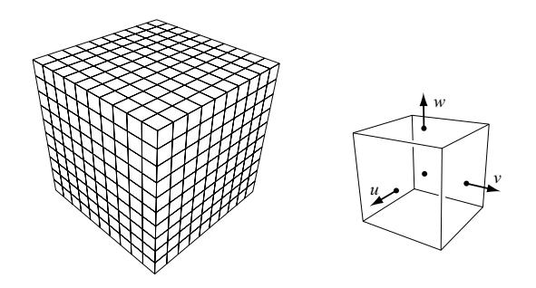
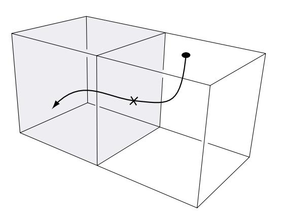
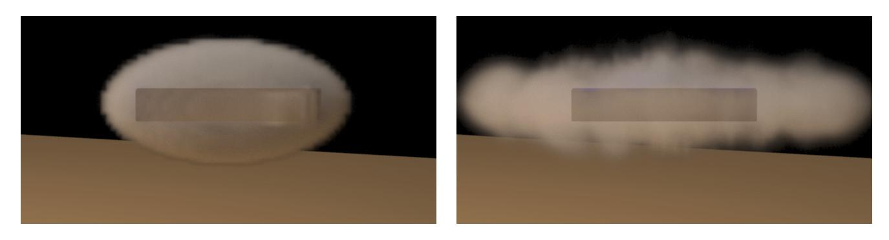
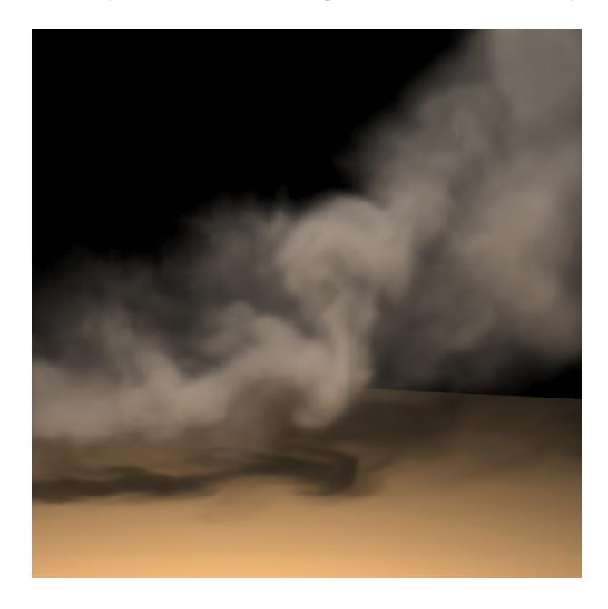
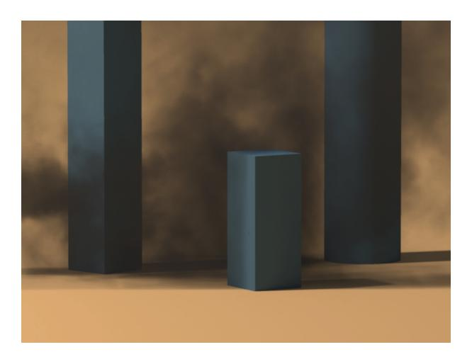
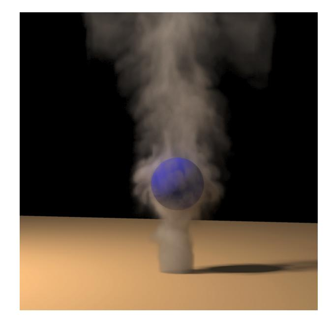
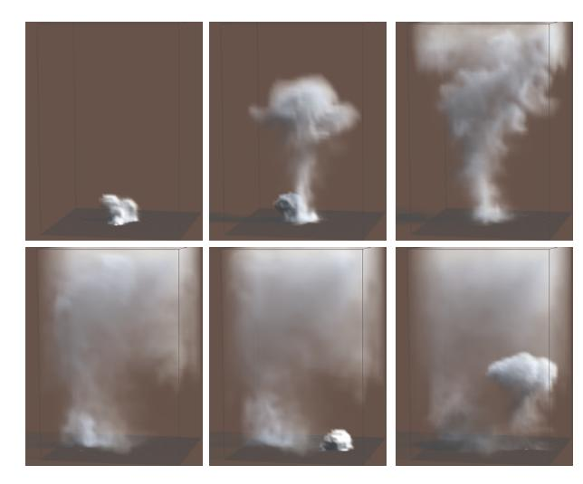
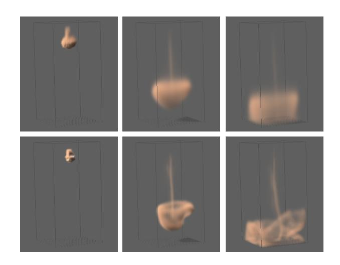
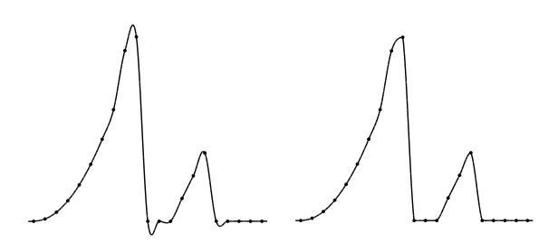

# **Visual Simulation of Smoke**

Ronald Fedkiw

Jos Stamy

Stanford University

Henrik Wann Jensenz

Aliaswavefront

Stanford University

# **Abstract**

In this paper, we propose a new approach to numerical smoke simulation for computer graphics applications. The method proposed here exploits physics unique to smoke in order to design a numerical method that is both fast and efficient on the relatively coarse grids traditionally used in computer graphics applications (as compared to the much finer grids used in the computational fluid dynamics literature). We use the inviscid Euler equations in our model, since they are usually more appropriate for gas modeling and less computationally intensive than the viscous Navier-Stokes equations used by others. In addition, we introduce a physically consistent vorticity confinement term to model the small scale rolling features characteristic of smoke that are absent on most coarse grid simulations. Our model also correctly handles the interaction of smoke with moving objects.

**Keywords:** Smoke, computational fluid dynamics, Navier-Stokes equations, Euler equations, Semi-Lagrangian methods, stable fluids, vorticity confinement, participating media

# **1 Introduction**

The modeling of natural phenomena such as smoke remains a challenging problem in computer graphics (CG). This is not surprising since the motion of gases such as smoke is highly complex and turbulent. Visual smoke models have many obvious applications in the industry including special effects and interactive games. Ideally, a good CG smoke model should both be easy to use and produce highly realistic results.

Obviously the modeling of smoke and gases is of importance to other engineering fields as well. More generally, the field of computational fluid dynamics (CFD) is devoted to the simulation of gases and other fluids such as water. Only recently have researchers in computer graphics started to excavate the abundant CFD literature for algorithms that can be adopted and modified for computer graphics applications. Unfortunately, current CG smoke models are either too slow or suffer from too much numerical dissipation. In this paper we adapt techniques from the CFD literature specific to the animation of gases such as smoke. We propose a model which is stable, rapid and doesn't suffer from excessive numerical dissipation. This allows us to produce animations of complex rolling smoke even on relatively coarse grids (as compared to the ones used in CFD).

### **1.1 Previous Work**

The modeling of smoke and other gaseous phenomena has received a lot of attention from the computer graphics community over the last two decades. Early models focused on a particular phenomenon and animated the smoke's density directly without modeling its velocity [10, 15, 5, 16]. Additional detail was added using solid textures whose parameters were animated over time. Subsequently, random velocity fields based on a Kolmogoroff spectrum were used to model the complex motion characteristic of smoke [18]. A common trait shared by all of these early models is that they lack any dynamical feedback. Creating a convincing dynamic smoke simulation is a time consuming task if left to the animator.

A more natural way to model the motion of smoke is to simulate the equations of fluid dynamics directly. Kajiya and Von Herzen were the first in CG to do this [13]. Unfortunately, the computer power available at the time (1984) only allowed them to produce results on very coarse grids. Except for some models specific to two-dimensions [21, 9], no progress was made in this direction until the work of Foster and Metaxas [7, 6]. Their simulations used relatively coarse grids but produced nice swirling smoke motions in three-dimensions. Because their model uses an explicit integration scheme, their simulations are only stable if the time step is chosen small enough. This makes their simulations relatively slow, especially when the fluid velocity is large *anywhere* in the domain of interest. To alleviate this problem Stam introduced a model which is unconditionally stable and consequently could be run at any speed [17]. This was achieved using a combination of a semi-Lagrangian advection schemes and implicit solvers. Because a first order integration scheme was used, the simulations suffered from too much numerical dissipation. Although the overall motion looks fluid-like, small scale vortices typical of smoke vanish too rapidly.

Recently, Yngve et al. proposed solving the compressible version of the equations of fluid flow to model explosions [22]. While the compressible equations are useful for modeling shock waves and other compressible phenomena, they introduce a very strict time step restriction associated with the acoustic waves. Most CFD practitioners avoid this strict condition by using the incompressible equations whenever possible. For that reason, we do not consider the compressible flow equations. Another interesting alternative which we do not pursue in this paper is the use of lattice gas solvers based on cellular automata [4].

## **1.2 Our Model**

Our model was designed specifically to simulate gases such as smoke. We model the smoke's velocity with the incompressible Euler equations. These equations are solved using a semi-Lagrangian integration scheme followed by a pressure-Poisson equation as in [17]. This guarantees that our model is stable for any choice of the time step. However, one of our main contributions is a method

Stanford University, Gates Computer Science Bldg., Stanford, CA 94305-9020, fedkiw@cs.stanford.edu

y Alias wavefront, 1218 Third Ave, 8th Floor, Seattle, WA 98101, U.S.A. jstam@aw.sgi.com

z Stanford University, Gates Computer Science Bldg., Stanford, CA 94305-9020, henrik@graphics.stanford.edu

to reduce the numerical dissipation inherent in semi-Lagrangian schemes. We achieve this by using a technique from the CFD literature known as "vorticity confinement" [20]. The basic idea is to inject the energy lost due to numerical dissipation back into the fluid using a forcing term. This force is designed specifically to increase the vorticity of the flow. Visually this keeps the smoke alive over time. This forcing term is completely consistent with the Euler equations in the sense that it disappears as the number of grid cells is increased. In CFD this technique was applied to the numerical computation of complex turbulent flow fields around helicopters where it is not possible to add enough grid points to accurately resolve the flow field. The computation of the force only adds a small computational overhead. Consequently our simulations are almost as fast as the one's obtained from the basic Stable Fluids algorithm [17]. Our model remains stable as long as the magnitude of the forcing term is kept below a certain threshold. Within this range, our time steps are still orders of magnitude higher than the ones used in explicit schemes.

Semi-Lagrangian schemes are very popular in the atmospheric sciences community for modeling large scale flows dominated by constant advection where large time steps are desired, see e.g. [19] for a review. We borrow from this literature a higher order interpolation technique that further increases the quality of the flows. This technique is especially effective when moving densities and temperatures through the velocity field.

Finally, our model, like Foster and Metaxas' [6], is able to handle boundaries inside the computational domain. Therefore, we are able to simulate smoke swirling around objects such as a virtual actor.

The rest of the paper is organized as follows. In the next section we derive our model from the equations of fluid flow, and in section  $3$  we discuss vorticity confinement. In section 4, we outline our implementation. In section 5, we present both an interactive and a high quality photon map based renderer to depict our smoke simulations. Subsequently, in section 6, we present some results, while section 7 concludes and discusses future work.

#### The Equations of Fluid Flow 2

At the outset, we assume that our gases can be modeled as inviscid, incompressible, constant density fluids. The effects of viscosity are negligible in gases especially on coarse grids where numerical dissipation dominates physical viscosity and molecular diffusion. When the smoke's velocity is well below the speed of sound the compressibility effects are negligible as well, and the assumption of incompressibility greatly simplifies the numerical methods. Consequently, the equations that model the smoke's velocity, denoted by  $\mathbf{u} = (u, v, w)$ , are given by the incompressible Euler equations [14]

$$\nabla \cdot \mathbf{u} = 0 \tag{1}$$

$$\frac{\partial \mathbf{u}}{\partial t} = -(\mathbf{u} \cdot \nabla)\mathbf{u} - \nabla p + \mathbf{f}.$$
 (2)

These two equations state that the velocity should conserve both mass (Equation 1) and momentum (Equation 2). The quantity  $p$  is the pressure of the gas and  $\mathbf{f}$  accounts for external forces. Also we have arbitrarily set the constant density of the fluid to one.

As in  $[7, 6, 17]$  we solve these equations in two steps. First we compute an intermediate velocity field  $\mathbf{u}^*$  by solving Equation 2 over a time step  $\Delta t$  without the pressure term

$$\frac{\mathbf{u}^* - \mathbf{u}}{\Delta t} = -(\mathbf{u} \cdot \nabla)\mathbf{u} + \mathbf{f}.$$
 (3)

After this step we force the field  $\mathbf{u}^*$  to be incompressible using a projection method [3]. This is equivalent to computing the pressure from the following Poisson equation

$$\nabla^2 p = \frac{1}{\Delta t} \nabla \cdot \mathbf{u}^* \tag{4}$$

with pure Neumann boundary condition, i.e.,  $\frac{\partial p}{\partial \mathbf{n}} = 0$  at a boundary point with normal  $\mathbf{n}$ . (Note that it is also straightforward to impose Dirichlet boundary conditions where the pressure is specified directly as opposed to specifying its normal derivative.) The intermediate velocity field is then made incompressible by subtracting the gradient of the pressure from it

$$\mathbf{u} = \mathbf{u}^* - \Delta t \nabla p. \tag{5}$$

We also need equations for the evolution of both the temperature T and the smoke's density  $\rho$ . We assume that these two scalar quantities are simply moved (advected) along the smoke's velocity

$$\frac{\partial T}{\partial t} = -(\mathbf{u} \cdot \nabla)T,\tag{6}$$

$$\frac{\partial \rho}{\partial t} = -(\mathbf{u} \cdot \nabla)\rho. \tag{7}$$

Both the density and the temperature affect the fluid's velocity. Heavy smoke tends to fall downwards due to gravity while hot gases tend to rise due to buoyancy. We use a simple model to account for these effects by defining external forces that are directly proportional to the density and the temperature

$$\mathbf{f}_{\text{buoy}} = -\alpha \rho \mathbf{z} + \beta (T - T_{\text{amb}}) \mathbf{z},\tag{8}$$

where  $\mathbf{z} = (0, 0, 1)$  points in the upward vertical direction,  $T_{\text{amb}}$ is the ambient temperature of the air and  $\alpha$  and  $\beta$  are two positive constants with appropriate units such that Equation 8 is physically meaningful. Note that when  $\rho = 0$  and  $T = T_{\text{amb}}$ , this force is zero.

Equations 2, 6 and 7 all contain the advection operator  $-(\mathbf{u} \cdot \nabla)$ . As in [17], we solve this term using a semi-Lagrangian method [19]. We solve the Poisson equation (Equation 4) for the pressure using an iterative solver. We show in Section 4 how these solvers can also handle bodies immersed in the fluid.

### **Vorticity Confinement** 3

Usually smoke and air mixtures contain velocity fields with large spatial deviations accompanied by a significant amount of rotational and turbulent structure on a variety of scales. Nonphysical numerical dissipation damps out these interesting flow features, and the goal of our new approach is to add them back on the coarse grid. One way of adding them back would be to create a random or pseudo-random small scale perturbation of the flow field using either a heuristic or physically based model. For example, one could generate a divergence free velocity field using a Kolmogorov spectrum and add this to the computed flow field to represent the missing small scale structure (see [18] for some CG applications of the Kolmogorov spectrum). While this provides small scale detail to the flow, it does not place the small scale details in the physically correct locations within the flow field where the small scale details are missing. Instead, the details are added in a haphazard fashion and the smoke can appear to be "alive", rolling and curling in a nonphysical fashion. The key to realistic animation of smoke is to make it look like a passive natural phenomena as opposed to a "living" creature made out of smoke.

Our method looks for the locations within the flow field where small scale features should be generated and adds the small scale features in these locations in a physically based fashion that promotes the passive rolling of smoke that gives it the realistic turbulent look on a coarse CG grid. With unlimited computing power,

Figure 1: Discretization of the computational domain into identical voxels (left). The components of the velocity are defined on the faces of each voxel (right).

any consistent numerical method could be used to obtain acceptable results simply by increasing the number of grid points until the desired limiting behavior is observed. However, in practice, computational resources are limited, grids are fairly coarse (even coarser in CG than in CFD), and the discrete difference equations may not be asymptotically close enough to the continuous equations for a particular simulation to behave in the desired physically correct fashion. Our key idea is to design a consistent numerical method that behaves in an interesting and physically plausible fashion on a coarse grid. In general, this is very difficult to do, but luckily a vorticity confinement method was recently invented by Steinhoff, see e.g. [20], for the numerical computation of complex turbulent flow fields around helicopters where it is not possible to add enough grid points to accurately resolve the flow.

The first step in generating the small scale detail is to identify where it comes from. In incompressible flow, the vorticity

$$\boldsymbol{\omega} = \nabla \times \mathbf{u} \tag{9}$$

provides the small scale structure. Each small piece of vorticity can be thought of as a paddle wheel trying to spin the flow field in a particular direction. Artificial numerical dissipation damps out the effect of these paddle wheels, and the key idea is to simply add it back. First normalized vorticity location vectors

$$\mathbf{N} = \frac{\boldsymbol{\eta}}{|\boldsymbol{\eta}|} \qquad (\boldsymbol{\eta} = \nabla |\boldsymbol{\omega}|) \tag{10}$$

that point from lower vorticity concentrations to higher vorticity concentrations are computed. Then the magnitude and direction of the paddle wheel force is computed as

$$\mathbf{f}_{\text{conf}} = \epsilon \ h \ (\mathbf{N} \times \boldsymbol{\omega}) \tag{11}$$

where  $\epsilon > 0$  is used to control the amount of small scale detail added back into the flow field and the dependence on the spatial discretization  $h$  guarantees that as the mesh is refined the physically correct solution is still obtained.

This technique was invented by Steinhoff about 10 years ago with a form similar to Equation 11 without the dependence on  $h$ , see for example [20]. This method has been used successfully as an engineering model for very complex flow fields, such as those associated with rotorcraft, where one cannot computationally afford to add enough grid points to resolve the important small scale features of the flow.

### Implementation 4

We use a finite volume spatial discretization to numerically solve the equations of fluid flow. As shown in Figure 1, we dice up the

Figure 2: Semi-Lagrangian paths that end up in a boundary voxel are clipped against the boundaries' face.

computational domain into identical voxels. The temperature, the smoke's density and the external forces are defined at the center of each voxel while the velocity is defined on the appropriate voxel faces (see Figure 1, right). Notice that this arrangement is identical to that of Foster and Metaxas [6] but differs from the one used by Stam [17] where the velocity was defined at the voxel centers as well. Our staggered grid arrangement of the velocity field gives improved results for numerical methods with less artificial dissipation. See appendix A for more details on our discretization.

To handle boundaries immersed in the fluid we tag all voxels that intersect an object as being occupied. All occupied voxel cell faces have their velocity set to that of the object. Similarly, the temperature at the center of the occupied voxels is set to the object's temperature. Consequently an animator can create many interesting effects by simply moving or heating up an object. The smoke's density is of course equal to zero inside the object. However, to avoid a sudden drop-off of the density near the object's boundary, we set the density at boundary voxels equal to the density of the closest unoccupied voxel.

Our solver requires two voxel grids for all physical quantities. We advance our simulation by updating one grid from the other over a fixed time step  $\Delta t$ . At the end of each time step we swap these grids. The grid may initially contain some user provided data, but in most cases the grids are simply empty. We first update the velocity components of the fluid. This is done in three steps. First, we add the force fields to the velocity grid. The forces include user supplied fields, the buoyancy force defined by Equation 8 and the new confinement force defined by Equation 11. This is done by simply multiplying each force by the time step and adding it to the velocity (see appendix A). Next we solve for the advection term in Equation 3. We do this using a semi-Lagrangian scheme, see [19] for a review and  $[17]$  for its first application in computer graphics.

The semi-Lagrangian algorithm builds a new grid of velocities from the ones already computed by tracing the midpoints of each voxel face through the velocity field. New velocities are then interpolated at these points and their values are transferred to the face cells they originated from. It is possible that the point ends up in one of the occupied voxels. In this case we simply clip the path against the voxel boundary as shown in Figure 2. This guarantees that the point always lies in the unoccupied fluid. Simple linear interpolation is easy to implement and combined with our new confinement force gives satisfactory results. It is also unconditionally stable. Higher order interpolation schemes are, however, desirable in some cases for high quality animations. The tricky part with higher order schemes is that they usually overshoot the data which results in

instabilities. In appendix  $B$  we provide a cubic interpolator which does not overshoot the data.

Finally we force the velocity field to conserve mass. As already stated in section 2, this involves the solution of a Poisson equation for the pressure (Equation 4). The discretization of this equation results in a sparse linear system of equations. We impose free Neumann boundary conditions at the occupied voxels by setting the normal pressure gradient equal to zero at the occupied boundary faces. The system of equations is symmetric, and the most natural linear solver in this case is the conjugate gradient method. This method is easy to implement and has much better convergence properties than simple relaxation methods. To improve the convergence we used an incomplete Choleski preconditioner. These techniques are all quite standard and we refer the reader to the standard text [11] for more details. In practice we found that only about 20 iterations of this solver gave us visually acceptable results. After the pressure is computed, we subtract its gradient from the velocity. See appendix A for the exact discretization of the operators involved.

After the velocity is updated, we advect both the temperature and the smoke's density. We solve these equations using again a semi-Lagrangian scheme. In this case, however, we trace back the centers of each voxel. The interpolation scheme is similar to the velocity case.

### Rendering 5

For every time step, our simulator outputs a grid that contains the smoke's density  $\rho$ . In this section we present algorithms to realistically render the smoke under various lighting conditions. We have implemented both a rapid hardware based renderer as in [17] and a high quality global illumination renderer based on the photon map [12]. The hardware based renderer provides rapid feedback and allows an animator to get the smoke to "look right". The more expensive physics-based renderer is used at the end of the animation pipeline to get production quality animations of smoke.

We first briefly recall the additional physical quantities needed to characterize the interaction of light with smoke. The amount of interaction is modeled by the inverse of the mean free path of a photon before it collides with the smoke and is called the extinction coefficient  $\sigma_t$ . The extinction coefficient is directly related to the density of the smoke through an extinction cross-section  $C_{\text{ext}}$ :  $\sigma_t = C_{\text{ext}} \rho$ . At each interaction with the smoke a photon is either scattered or absorbed. The probability of scattering is called the albedo  $\Omega$ . A value of the albedo near zero corresponds to very dark smoke, while a value near unity models bright gases such as steam and clouds.

In general the scattering of light in smoke is mostly focused in the forward direction. The distribution of scattered light is modeled through a phase function  $p(\theta)$  which gives the probability that an incident photon is deflected by an angle  $\theta$ . A convenient model for the phase function is the Henyey-Greenstein function

$$p(\theta) = \frac{1 - g^2}{(1 + g^2 - 2g\cos\theta)^{3/2}},\tag{12}$$

where the dimensionless parameter  $g < 1$  models the anisotropy of the scattering. Values near unity of this parameter correspond to gases which scatter mostly in the forward direction. We mention that this phase function is quite arbitrary and that other choices are possible [1].

#### 5.1 Hardware-Based Renderer

In our implementation of the hardware-based renderer, we follow the algorithm outlined in [17]. In a first pass, we compute the amount of light that directly reaches each voxel of the grid. This is achieved using a fast Bresenham line drawing voxel traversal algorithm [8]. Initially the transparencies of each ray are set to one  $(T_{\text{ray}} = 1)$ . Then, each time a voxel is hit, the transparency is computed from the voxel's density:  $T_{\text{vox}} = \exp(-C_{\text{ext}}h)$ , where h is the grid spacing. Then the voxel's radiance is set to

$$L_{\rm vox} = \Omega \ L_{\rm light} \ (1 - T_{\rm vox}) \ T_{\rm ray}$$

while the transparency of the ray is simply multiplied by the voxel's transparency:  $T_{\text{ray}} = T_{\text{ray}}T_{\text{vox}}$ . Since the transparency of the ray diminishes as it traverses the smoke's density this pass correctly mimics the effects of self-shadowing.

In a second pass we render the voxel grid from front to back. We decompose the voxel grid into a set of two-dimensional grid-slices along the coordinate axis most aligned with the viewing direction. The vertices of this grid-slice correspond to the voxel centers. Each slice is then rendered as a set of transparent quads. The color and opacity at each vertex of a quad correspond to the radiance  $L_{\rm vox}$ and the opacity  $1-T_{\rm vox},$  respectively, of the corresponding voxel. The blending between the different grid slices when rendered from front to back is handled by the graphics hardware.

# 5.2 Photon Map Renderer

Realistic rendering of smoke with a high albedo (such as water vapor) requires a full simulation of multiple scattering of light inside the smoke. This involves solving the full volume rendering equation [2] describing the steady-state of light in the presence of participating media. For this purpose we use the photon mapping algorithm for participating media as introduced in [12]. This is a two pass algorithm in which the first pass consists of building a volume photon map by emitting photons towards the medium and storing these as they interact with the medium. We only store the photons corresponding to indirect illumination.

In the rendering pass we use a forward ray marching algorithm. We have found this to be superior to the backward ray marching algorithm proposed in [12]. The forward ray marching algorithm allows for a more efficient culling of computations in smoke that is obscured by other smoke. In addition it enables a more efficient use of the photon map by allowing us to use less photons in the query as the ray marcher gets deeper into the smoke. Our forward ray marcher has the form

$$L_n(x_n, \vec{\omega}) = L_{n-1}(x_{n-1}, \vec{\omega}) + e^{-\tau(x_n)} \Delta x_n(\vec{\omega} \cdot \vec{\nabla}) L_s(x'_n, \vec{\omega})$$
(13)

where  $\tau(x_n) = \int_{x_0}^{x_n} \sigma_t \, dx$  is the optical depth,  $L_s$  is the fraction of the inscattered radiance that is scattered in direction  $\vec{\omega}, \Delta x_n > 0$  is the size of the *n*th step,  $x_{n+1} = x_n + \Delta x_n$  and  $x'_n$  is a randomly chosen location in the *n*th segment. The factor  $e^{-\tau(x_n)}$  can be considered the weight of the  $n$ th segment, and we use this value to adjust the required accuracy of the computation.

The contribution due to in-scattered radiance,  $L_i$ , is given by

$$(\vec{\omega} \cdot \vec{\nabla}) L_s(x, \vec{\omega}) = \Omega \ \sigma_t(x) \int_{4\pi} L_i(x, \vec{\omega}'_s) p(x'_n, \vec{\omega}', \vec{\omega}) \ d\omega' \tag{14}$$

We split the inscattered radiance into a single scattering term,  $L_d$ , and a multiple scattering term,  $L_m$ . The single scattering term is computed using standard ray tracing, and the multiple scattering term is computed using the volume radiance estimate from the photon map by locating the  $n_p$  nearest photons. This gives:

$$(\vec{\omega} \cdot \vec{\nabla}) L_m(x, \vec{\omega}) = \sum_{1}^{n_p} \frac{\Phi_p(\vec{\omega}') p(x, \vec{\omega}', \vec{\omega})}{\frac{4}{3} \pi r^3}.$$
 (15)

Here  $\Phi_p$  is the power of the *p*th photon and *r* is the smallest sphere enclosing the  $n_n$  photons.

Figure 6: Two stills from the rotor animation. A box is rotating inside the smoke cloud causing it to disperse. Notice how the smoke is sucked in vertically towards the box as it is pushed outwards horizontally. The simulation time for a 120x60x120 grid was roughly 60 seconds/frame.

Figure 3: Rising smoke. Notice how the vorticies are preserved in the smoke. The simulation time for a 100x100x40 grid was roughly 30 seconds/frame.

Figure 4: Low albedo smoke passing through several objects. Each object interacts with the smoke and causes local turbulence and vorticity. The simulation time for a 160x80x80 grid was roughly 75 seconds/frame.

Figure 5: Rising smoke swirling around a sphere. Notice how the smoke correctly moves around the sphere. The simulation time for a 90x135x90 grid was roughly 75 seconds/frame.

Figure 7: Six frames rendered using our interactive hardware renderer of the smoke. The simulation time for a 40x40x40 grid was roughly 1 second/frame.

Figure 8: Comparison of linear interpolation (top) and our new monotonic cubic interpolation (bottom). The simulation time for a 20x20x40 grid was roughly 0.1 second/frame (linear) and 1.8 seconds/frame (third order).

#### Results 6

This section contains several examples of smoke simulations. We have run most of the simulations including the rendering on a dual-Pentium3-800 or comparable machine. The images in Figures 3-6 have been rendered at a width of 1024 pixels using 4 samples per pixel. These photon map renderings were done using 1-2 million photons in the volume photon map and the rendering times for all the photon map images are 20-45 minutes.

Figure 3 is a simple demonstration of smoke rising. The only external force on the smoke is the natural boyancy of the smoke causing it to rise. Notice how even this simple case is enough to create a realistic and swirly apperance of the smoke. Figures 4 and 5 demonstrate that our solver correctly handles the interaction with objects immersed in the smoke. These objects need not be at rest. Figure 6 shows two stills from an animation where a rotating cube is inside a smoke cloud. The rotation of the cube causes the smoke to be pushed out horizontally and sucked in vertically. The grid resolutions and the cost of each time step are reported in the figure captions.

Figure 7 shows six frames of an animation rendered using our interactive renderer. The rendering time for each frame was less than a second on a nVidia Quadro graphics card. The speed, while not real-time, allowed an animator to interactively place densities and heat sources in the scene and watch the smoke raise and billow.

Finally, Figure 8 demonstrates the benefits of using a higher order interpolant in the semi-Lagrangian scheme. The three pictures on the top show the appearance of falling smoke using a linear interpolant, while the pictures on the bottom show the same smoke using our new monotonic cubic interpolant. Clearly the new interpolation reduces the amount of numerical dissipation and produces smoke simulations with more fine detail.

#### 7 Conclusions

In this paper we proposed a new smoke model which is both stable and does not suffer from numerical dissipation. We achieved this through the use of a new forcing term that adds the lost energy back exactly where it is needed. We also included the interaction of objects with our smoke. We believe that our model is ideal for CG applications where visual detail and speed are crucial.

We think that vorticity confinement is a very elegant and powerful technique. We are investigating variants of this technique custom tailored for other phenomena such as fire. We are also investigating techniques to improve the interaction of the smoke with objects. In our current model objects may sometimes be too coarsely sampled on the grid.

### Acknowledgements 8

We would like to thank John Steinhoff (Flow Analysis Inc. and UTSI) and Pat Hanrahan (Stanford University) for many helpful discussions. The work of the first author was supported in part by ONR N00014-97-1-0027. The work of the last author was supported by NSF/ITR (IIS-0085864) and DARPA (DABT63-95-C-0085).

### Discretization Α

We assume a uniform discretization of space into  $N^3$  voxels with uniform spacing  $h$ . The temperature and the smoke's density are both defined at the voxel centers and denoted by

$$T_{i,j,k} \quad \text{and} \quad \rho_{i,j,k}, \qquad i,j,k = 1,\cdots,N,$$

respectively. The velocity on the other hand is defined at the cell faces. It is usual in the CFD literature to use half-way index notation for this

$$\begin{array}{ll} u_{i+1/2,j,k}, & i=0,\cdots,N, \quad j,k=1,\cdots,N, \\ v_{i,j+1/2,k}, & j=0,\cdots,N, \quad i,k=1,\cdots,N, \\ w_{i,j,k+1/2}, & k=0,\cdots,N, \quad i,j=1,\cdots,N. \end{array}$$

Using these notations we can now define some discrete operators. The divergence is defined as

$$(\nabla \cdot \mathbf{u})_{i,j,k} = (u_{i+1/2,j,k} - u_{i-1/2,j,k} + v_{i,j+1/2,k} - v_{i,j-1/2,k} + w_{i,j,k+1/2} - w_{i,j,k-1/2})/k$$

while the discrete gradients are (note  $\nabla p = (p_x, p_y, p_z)$ )

$$\begin{array}{rcl} (p_x)_{i+1/2,j,k} &=& (p_{i+1,j,k}-p_{i,j,k})/h, \\ (p_y)_{i,j+1/2,k} &=& (p_{i,j+1,k}-p_{i,j,k})/h, \\ (p_z)_{i,j,k+1/2} &=& (p_{i,j,k+1}-p_{i,j,k})/h. \end{array}$$

The discrete Laplacian is simply the combination of the divergence and the gradient operators. The discrete version of the vorticity  $\boldsymbol{\omega} = (\omega^1, \omega^2, \omega^3)$  is defined as follows. First we compute the cellcentered velocities through averaging

$$\begin{array}{rcl} \bar{u}_{i,j,k} &=& (u_{i-1/2,j,k} + u_{i+1/2,j,k})/2, \\ \bar{v}_{i,j,k} &=& (v_{i,j-1/2,j} + v_{i,j+1/2,j})/2, \\ \bar{w}_{i,j,k} &=& (w_{i,j,k-1/2} + w_{i,j,k+1/2})/2. \end{array}$$

Then

$$\begin{array}{rcl}\n\omega_{i,j,k}^1 &=& \left(\bar{w}_{i,j+1,k} - \bar{w}_{i,j-1,k} - \bar{v}_{i,j,k+1} + \bar{v}_{i,j,k-1}\right) / 2h \\
\omega_{i,j,k}^2 &=& \left(\bar{u}_{i,j,k+1} - \bar{u}_{i,j,k-1} - \bar{w}_{i+1,j,k} + \bar{w}_{i-1,j,k}\right) / 2h \\
\omega_{i,j,k}^3 &=& \left(\bar{v}_{i+1,j,k} - \bar{v}_{i-1,j,k} - \bar{u}_{i,j+1,k} + \bar{u}_{i,j-1,k}\right) / 2h.\n\end{array}$$

Figure 9: Standard cubic Hermite interpolation (left) produces overshoots while our modified interpolation scheme (right) guarantees that no overshoots occur.

All of our force fields are defined at the center of the grid voxels. To get values at the faces we simply average again. If the force field  $\mathbf{f} = (f^1, f^2, f^3)$ , then the velocity is updated as

$$\begin{array}{rcl} u_{i+1/2,j,k} & + = & \Delta t \ (f_{i,j,k}^1 + f_{i+1,j,k}^1)/2, \\ v_{i,j+1/2,k} & + = & \Delta t \ (f_{i,j,k}^2 + f_{i,j+1,k}^2)/2, \\ w_{i,j,k+1/2} & + = & \Delta t \ (f_{i,j,k}^3 + f_{i,j,k+1}^3)/2. \end{array}$$

#### Β Monotonic Cubic Interpolation

In this appendix we present a cubic interpolation scheme which does not overshoot the data. Since our voxel grids are regular the three-dimensional interpolation can be broken down into a sequence of one-dimensional interpolations along each coordinate axis. Therefore, it is sufficient to describe the one-dimensional case only. The data consists of a set of values  $f_k$  defined at the locations  $k = 0, \dots, N$ . A value at a point  $t \in [t_k, t_{k+1}]$  can be interpolated using a Hermite interpolant as follows [8]

$$f(t) = a_3(t - t_k)^3 + a_2(t - t_k)^2 + a_1(t - t_k) + a_0$$

where

$$\begin{array}{rcl} a_3 &=& d_k + d_{k+1} - \Delta_k \\ a_2 &=& 3\Delta_k - 2d_k - d_{k+1} \\ a_1 &=& d_k \\ a_0 &=& f_k \end{array}$$

and

$$d_k = (f_{k+1} - f_{k-1})/2, \quad \Delta_k = f_{k+1} - f_k.$$

However, this interpolant usually overshoots the data as we show on the left hand side of Figure 9. We want to avoid this, since monotone interpolation guarantees stability. One solution is to simply clip the interpolation against the data, but this results in sharp discontinuities. Another remedy is to force the interpolant to be monotonic over each interval  $[t_k, t_{k+1}]$ . A necessary condition for this to be the case is that

$$\begin{cases} \begin{array}{ll} sign(d_k) = sign(d_{k+1}) = sign(\Delta_k) & \Delta_k \neq 0 \ d_k = d_{k+1} = 0 \end{array} \end{cases}$$

In our implementation we first compute  $\Delta_k$  and then set the slopes to zero whenever they have a sign different from  $\Delta_k$ . On the right hand side of Figure 9, we show the our new interpolant applied to the same data. Clearly the overshooting problem is fixed.

# References

- [1] P. Blasi, B. Le Saec, and C. Schlick. A Rendering Algorithm for Discrete Volume Density Objects. *Computer Graph*ics Forum (EUROGRAPHICS 93 Conference Proceedings), 12(3):201–210, 1993.
- [2] S. Chandrasekhar. Radiative Transfer. Dover, New York, 1960.
- [3] A. Chorin. A Numerical Method for Solving Incompressible Viscous Flow Problems. Journal of Computational Physics, 2:12–26, 1967.
- [4] Y. Dobashi, K. Kaneda, T. Okita, and T. Nishita. A Simple, Efficient Method for Realistic Animation of Clouds. In SIG-GRAPH 2000 Conference Proceedings, Annual Conference Series, pages 19-28, July 2000.
- [5] D. S. Ebert and R. E. Parent. Rendering and Animation of Gaseous Phenomena by Combining Fast Volume and Scanline A-buffer Techniques. *Computer Graphics (SIGGRAPH 90* Conference Proceedings), 24(4):357–366, August 1990.
- [6] N. Foster and D. Metaxas. Realistic Animation of Liquids. Graphical Models and Image Processing, 58(5):471-483, 1996.
- [7] N. Foster and D. Metaxas. Modeling the Motion of a Hot, Turbulent Gas. In SIGGRAPH 97 Conference Proceedings, Annual Conference Series, pages 181-188, August 1997.
- [8] J. D. Fowley, A. van Dam, S. K. Feiner, and J. F. Hughes. Computer Graphics: Principles and Practice. Second Edition. Addison-Wesley, Reading, MA, 1990.
- [9] M. N. Gamito, P. F. Lopes, and M. R. Gomes. Twodimensional Simulation of Gaseous Phenomena Using Vortex Particles. In Proceedings of the 6th Eurographics Workshop on Computer Animation and Simulation, pages 3-15. Springer-Verlag, 1995.
- [10] G. Y. Gardner. Visual Simulation of Clouds. Computer Graphics (SIGGRAPH 85 Conference Proceedings), 19(3):297–384, July 1985.
- [11] G. Golub and C. Van Loan. Matrix Computations. The John Hopkins University Press, Baltimore, 1989.
- [12] H. W. Jensen and P. H. Christensen. Efficient Simulation of Light Transport in Scenes with Participating Media using Photon Maps. In SIGGRAPH 98 Conference Proceedings, Annual Conference Series, pages 311–320, July 1998.
- [13] J. T. Kajiya and B. P. von Herzen. Ray Tracing Volume Densities. Computer Graphics (SIGGRAPH 84 Conference Pro*ceedings*), 18(3):165–174, July 1984.
- [14] L. D. Landau and E. M. Lifshitz. Fluid Mechanics, 2nd edition. Butterworth-Heinemann, Oxford, 1998.
- [15] K. Perlin. An Image Synthesizer. *Computer Graphics (SIG-*GRAPH 85 Conference Proceedings), 19(3):287–296, July 1985.
- [16] G. Sakas. Fast Rendering of Arbitrary Distributed Volume Densities. In F. H. Post and W. Barth, editors, Proceedings of EUROGRAPHICS '90, pages 519-530. Elsevier Science Publishers B.V. (North-Holland), September 1990.

- [17] J. Stam. Stable Fluids. In *SIGGRAPH 99 Conference Proceedings, Annual Conference Series*, pages 121–128, August 1999.
- [18] J. Stam and E. Fiume. Turbulent Wind Fields for Gaseous Phenomena. In *SIGGRAPH 93 Conference Proceedings, Annual Conference Series*, pages 369–376, August 1993.
- [19] A. Staniforth and J. Cote. Semi-lagrangian integration schemes for atmospheric models: A review. *Monthly Weather Review*, 119:2206–2223, 1991.
- [20] J. Steinhoff and D. Underhill. Modification of the euler equations for "vorticity confinement": Application to the computation of interacting vortex rings. *Physics of Fluids*, 6(8):2738– 2744, 1994.
- [21] L. Yaeger and C. Upson. Combining Physical and Visual Simulation. Creation of the Planet Jupiter for the Film 2010. *Computer Graphics (SIGGRAPH 86 Conference Proceedings)*, 20(4):85–93, August 1986.
- [22] G. Yngve, J. O'Brien, and J. Hodgins. Animating explosions. In *SIGGRAPH 2000 Conference Proceedings, Annual Conference Series*, pages 29–36, July 2000.